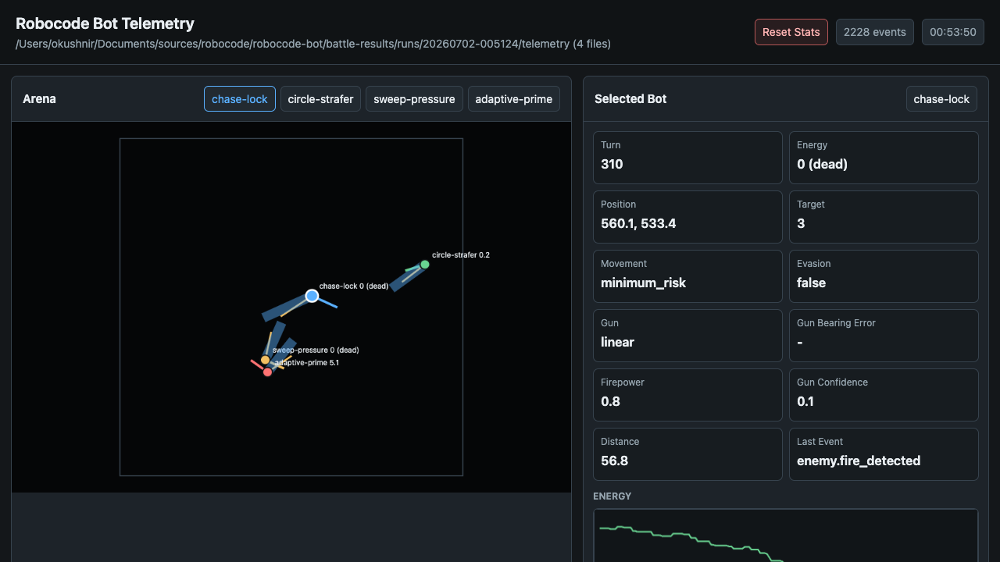

# Robocode Bot Workspace

Python bots, shared combat logic, battle automation, telemetry tooling, and
algorithm notes for Robocode Tank Royale.

Robocode Tank Royale docs:
[robocode-dev/tank-royale](https://github.com/robocode-dev/tank-royale) and
[robocode.dev](https://robocode.dev/).



## What Is Here

| Area | Purpose |
| --- | --- |
| `bots/` | Local bots, ported opponents, and shared `bot_core` code. |
| `scripts/` | Setup, packaging, battle, telemetry, and A/B entry points. |
| `tools/` | Battle runner, telemetry viewer, summaries, audits, and utilities. |
| `docs/` | Workflow, architecture, telemetry, and tuning documentation. |
| `tests/` | Unit tests for shared bot logic and tooling. |

Current local bots:

| Bot | Role |
| --- | --- |
| [Adaptive Prime](bots/adaptive-prime/README.md) | 1v1 champion candidate with surfing, potential fields, and adaptive firepower. |
| [Chase Lock](bots/chase-lock/README.md) | Target-lock pressure bot with range-band movement. |
| [Circle Strafer](bots/circle-strafer/README.md) | Defensive orbital bot with conservative wall and separation policy. |
| [Sweep Pressure](bots/sweep-pressure/README.md) | Direct pressure bot with sweeping movement. |
| [BasicGFSurfer Port](bots/ports/basic-gf-surfer-port/README.md) | Native Python reference opponent for surfer experiments. |

## First Run

Requirements: Python 3.x compatible with the project virtualenv, Java, and a
Bash-compatible shell.

```sh
cp .env.example .env
scripts/setup.sh
scripts/package.sh
scripts/run-battle.sh
```

Quick checks:

```sh
PYTHONPATH=bots .venv/bin/python -m pytest
scripts/run-battle.sh --rounds 1 bots/adaptive-prime bots/chase-lock
scripts/run-battle.sh --telemetry --rounds 1 bots/adaptive-prime bots/chase-lock
```

CLI battle artifacts are written under `battle-results/runs/<timestamp>/`.
Important files are `results.json`, `runner.log`, `process.log`, optional
`debug/`, optional `telemetry/`, and optional recordings.

## Documentation

| Need | Read |
| --- | --- |
| Setup, packaging, battle running, telemetry, A/B, port-first opponent policy | [Tooling](docs/tooling.md) |
| Shared behavior: radar, virtual guns, movement, fire gates, telemetry | [Shared Bot Systems](docs/bot-shared-systems.md) |
| Shared implementation structures: targets, waves, KNN, GF profiles, telemetry records | [Bot Core Data Structures](docs/bot-core-data-structures.md) |
| Concrete gun package behavior | [Gun Component Docs](docs/README.md#gun-component-docs) |
| Generated telemetry event contract | [Telemetry Event Schema](docs/telemetry-schema.md) |
| Specific bot behavior | [Bot Docs](docs/README.md#bot-docs) |
| Local championship snapshot | [Championship Results](docs/championship-results.md) |

Common workflow anchors:

| Workflow | Entry Point |
| --- | --- |
| Setup and package bots | [Tooling: Setup](docs/tooling.md#setup) |
| Run CLI battles | [Tooling: Battles](docs/tooling.md#battles) |
| Use telemetry viewer or schema generation | [Tooling: Telemetry](docs/tooling.md#telemetry) |
| Audit telemetry and summarize gun/combat results | [Tooling: Experiment Analysis](docs/tooling.md#experiment-analysis) |
| Compare baseline and candidate bots | [Tooling: A/B Runs](docs/tooling.md#ab-runs) |
| Use converted legacy bots for reference or porting | [Tooling: Converted Legacy Bots](docs/tooling.md#converted-legacy-bots) |

## Local Configuration

Copy `.env.example` to `.env` and keep machine-specific paths there. `.env`,
`battle-results/`, `dist/`, `.venv/`, and `legacy-bots/` are ignored.

Common settings:

```text
PYTHON_BIN
ROBOCODE_PYTHON_BIN
ROBOCODE_TELEMETRY_DIR
ROBOCODE_TELEMETRY_HOST
ROBOCODE_TELEMETRY_PORT
ROBOCODE_GUN_MODE
ROBOCODE_GUN_SET
ROBOCODE_LEGACY_BOTS_ROOT
```

Converted legacy bots are optional and mainly for parity or porting reference.
Prefer native Python ports under `bots/ports/` for repeatable tuning.

## License

Licensed under the Apache License, Version 2.0. See [LICENSE](LICENSE).
