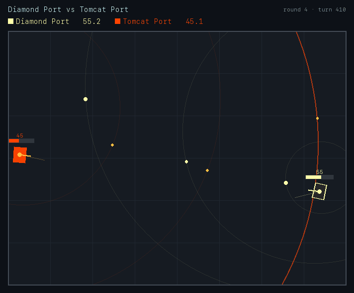
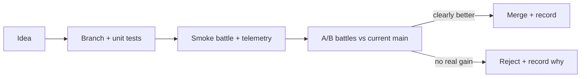
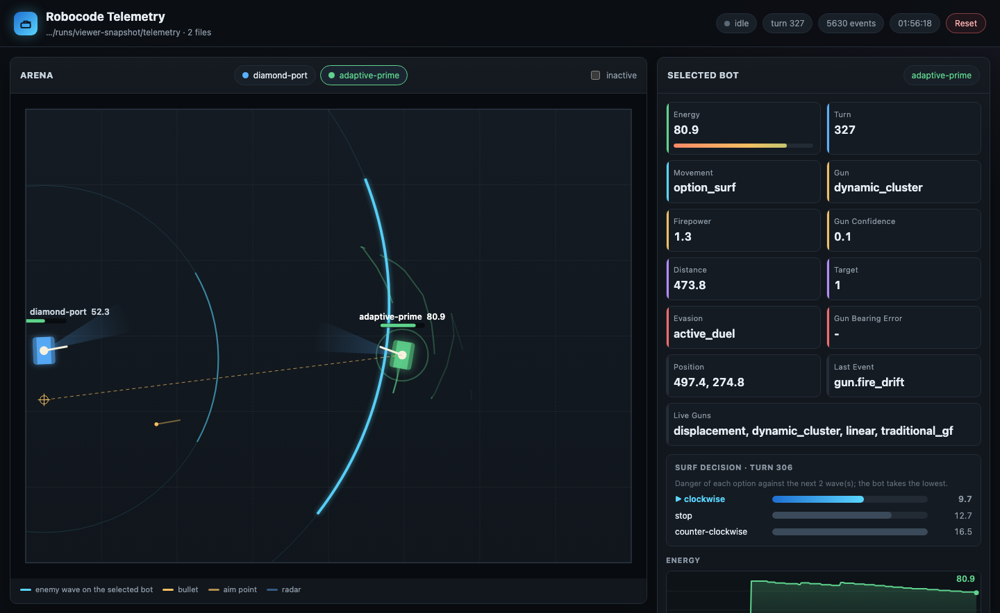

# Robocode Bot Workspace

[](https://www.python.org/)
[](https://robocode.dev/)
[](tests/)
[](LICENSE)

A battle lab for [Robocode Tank Royale](https://github.com/robocode-dev/tank-royale)
bots in Python: our own bots, native ports of classic RoboRumble champions to
spar against, and the tooling to prove whether a change made a bot stronger.



<sub>Diamond and Tomcat, two ported legends, wave surfing in a real recorded
battle. Each bold arc is a bullet closing in; watch the bots slip through it.</sub>

## Highlights

- **Ported legends.** Three famous Java Robocode bots rebuilt as native Python
  Tank Royale bots, including Voidious' Diamond, a long-time RoboRumble
  top-tier MegaBot. They are the sparring partners and the yardstick.
- **A champion in training.** Adaptive Prime combines virtual guns, enemy-fire
  detection, bullet shadows and Diamond-style option surfing.
- **Measured, not guessed.** Every tuning change has to win repeated A/B
  battles before it is merged, and ideas that don't help are written down,
  not kept.
- **Instruments.** Telemetry JSONL, a live viewer, turn-timing and motion
  audits, and an animated renderer for recordings.

## The Roster

| Bot | Kind | What it does |
| --- | --- | --- |
| [Adaptive Prime](bots/adaptive-prime/README.md) | Ours | Champion candidate: option surfing over learned danger, virtual guns, adaptive firepower, minimum-risk melee. |
| [Chase Lock](bots/chase-lock/README.md) | Ours | Pressure fighter that keeps targets pinned by range and lock discipline. |
| [Circle Strafer](bots/circle-strafer/README.md) | Ours | Defensive orbit bot built around survival, spacing, and wall recovery. |
| [Sweep Pressure](bots/sweep-pressure/README.md) | Ours | Direct-fire pressure bot with sweeping movement and projected wall avoidance. |
| [BasicGFSurfer Port](bots/ports/basic-gf-surfer-port/README.md) | Port | The classic guess-factor wave surfer; the fixed 1v1 benchmark, never tuned. |
| [Tomcat Port](bots/ports/tomcat-port/README.md) | Port | lxx.Tomcat 3.68 (jdev, 2013): wave surfing plus the Tomcat Claws replay gun. |
| [Diamond Port](bots/ports/diamond-port/README.md) | Port | voidious.Diamond 1.8.28 (Voidious, 2012): dynamic-clustering surfing and a virtual-gun array, 1v1 and melee. |

## Ported Legends

The ports are rebuilt class by class from the Java source shipped inside each
bot's jar, not wrapped. Tank Royale differs from classic Robocode in its API,
turn order, event timing and physics, so each port carries an adapter that
replays the original's view of the world, and its README lists every
difference and how it is handled.

Some things the ports had to get right:

- **Angles and turn order.** Classic Robocode measures headings clockwise from
  north; Tank Royale counter-clockwise from east. Events now arrive inside the
  turn call, so each port rebuilds the Java event order before deciding.
- **Physics.** Tank Royale brakes from full speed to zero in one turn and
  moves before it turns; surfing predictions were checked against engine tick
  samples.
- **Scan timing.** Enemy energy in a scan lags bullet hits by one turn, which
  would turn every hit into a phantom enemy shot. The Diamond port defers those
  energy corrections until after the scan is read.

How they rank today, from a round-robin of 24-round matches:

| Rank | Bot | Rounds won |
| ---: | --- | ---: |
| 1 | Diamond Port | 65 of 72 |
| 2 | Tomcat Port | 45 of 72 |
| 3 | Adaptive Prime | 23 of 72 |
| 4 | BasicGFSurfer Port | 11 of 72 |

Adaptive Prime beats the benchmark surfer and is starting to take rounds off
both legends; closing that gap is the goal of the
[roadmap](docs/plans/adaptive-prime-roadmap.md).

## How Bots Get Better


```mermaid
flowchart LR
    A["Idea"] --> B["Branch + unit tests"]
    B --> C["Smoke battle + telemetry"]
    C --> D["A/B battles vs current main"]
    D -->|"clearly better"| E["Merge + record"]
    D -->|"no real gain"| F["Reject + record why"]
```

The latest win was option surfing, borrowed from Diamond: before each enemy
bullet arrives, Adaptive Prime simulates orbiting either way or stopping, and
picks the safest. It raised the bot's score against the benchmark by 16%. The
full record, including every rejected idea, is in the
[Adaptive Prime roadmap](docs/plans/adaptive-prime-roadmap.md).

## Fastest Fight

Requirements: Python 3.10+, Java, and a Bash-compatible shell.

```sh
cp .env.example .env
scripts/setup.sh
scripts/package.sh
scripts/run-battle.sh --rounds 1 bots/adaptive-prime bots/ports/diamond-port
```

Watch the instruments:

```sh
scripts/run-battle.sh --telemetry --telemetry-open --rounds 1 bots/adaptive-prime bots/chase-lock
```



Benchmark a change:

```sh
scripts/run-ab.sh --name my-idea --preset adaptive-1v1-basic-gf-surfer-port --rounds 24 --repeats 6 \
  --candidate ../my-worktree
tools/ab_pool.py --candidate battle-results/ab/<experiment> --baseline battle-results/ab/<experiment>
```

CLI battle artifacts are written under `battle-results/runs/<timestamp>/`:
`results.json`, `runner.log`, `process.log`, and optional `debug/`,
`telemetry/` and `recordings/`. Run the unit tests with
`PYTHONPATH=bots .venv/bin/python -m pytest`.

## Repository Map

| Area | Purpose |
| --- | --- |
| `bots/` | Our bots and shared `bot_core` code. |
| `bots/ports/` | Native Python ports of reference opponents. |
| `scripts/` | Setup, packaging, battle, battle-series, telemetry, and A/B entry points. |
| `tools/` | Battle runner, telemetry viewer, A/B pooling, summaries, audits, GIF renderer. |
| `docs/` | Workflow, architecture, telemetry, and tuning documentation. |
| `tests/` | Unit tests for shared bot logic, ports, and tooling. |

## Documentation

| Need | Read |
| --- | --- |
| Setup, battles, telemetry, A/B runs, rendering | [Tooling](docs/tooling.md) |
| Shared behavior: radar, virtual guns, movement, fire gates, telemetry | [Shared Bot Systems](docs/bot-shared-systems.md) |
| Shared structures and formulas: waves, KNN, GF profiles, option surfing | [Bot Core Data Structures](docs/bot-core-data-structures.md) |
| Concrete gun package behavior | [Gun Component Docs](docs/README.md#gun-component-docs) |
| Generated telemetry event contract | [Telemetry Event Schema](docs/telemetry-schema.md) |
| Porting a legacy bot to native Python | [Legacy Bot Porting Guideline](docs/legacy-bot-porting-guideline.md) |
| Specific bot behavior | [Bot Docs](docs/README.md#bot-docs) |
| Tuning history and benchmark results | [Adaptive Prime Roadmap](docs/plans/adaptive-prime-roadmap.md) |

## Local Configuration

Copy `.env.example` to `.env` and keep machine-specific paths there; the
settings are described in [Tooling: Setup](docs/tooling.md#setup).

Converted legacy Java bots are optional and only for parity or porting
reference. Prefer the native ports under `bots/ports/` for repeatable tuning.

## License

Licensed under the Apache License, Version 2.0. See [LICENSE](LICENSE). The
ported bots are altered versions of other authors' work; each port's README
credits the original author and states the original notice, and the Diamond
port keeps its zlib license in [its own LICENSE](bots/ports/diamond-port/LICENSE).
