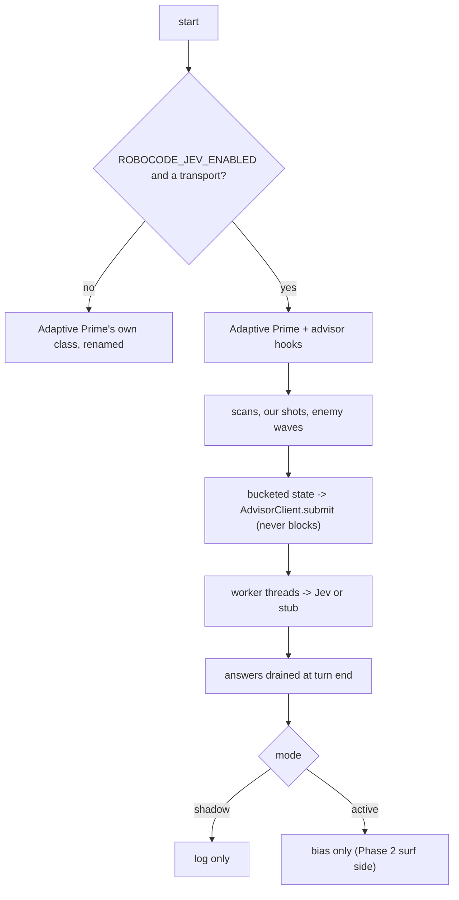

# Adaptive Jev

Adaptive Jev is an experimental variant of Adaptive Prime that can ask TypeSafe
AI's hosted Jev model typed questions during a battle. Jev never aims or steers.
Answers arrive asynchronously, are logged, and (in active mode only) may bias
an existing decision.

Shared references:

- [Jev advisor plan](../../docs/plans/jev-advisor-bot.md): goals, gates, and
  results.
- [Shared Bot Systems](../../docs/bot-shared-systems.md#advisors-experimental)
- [Tooling](../../docs/tooling.md#experimental-bots)

Bot-specific flags live in `jev_config.py`; the advisor layer is
`jev_advisor.py`.

## Behavior



- **Disabled (default).** `ROBOCODE_JEV_ENABLED=0`, or no key, runs
  `AdaptiveJevPassthrough`: Adaptive Prime's class with only a new bot name and
  telemetry file name. Every decision is Adaptive Prime's.
- **Enabled.** `AdaptiveJev` adds hooks after Adaptive Prime's handlers and
  swaps in `ObservedMovementFlattener`, which reports enemy waves and wave
  visits without changing any movement result. Shadow mode changes nothing.
- **Phase 1 (`style`).** An opponent-style `choice` once the enemy has been
  scanned 120 times, then every 200 scans. Each request also logs the
  rule-based label from the same features.
- **Phase 2 (`surf`).** A surf-side `choice` (forward, reverse, stop) for each
  confirmed enemy wave, plus an `advisor.outcome` record once both the answer
  and the wave's visit are known.

## Running

Put the key in `.env` only (`TYPESAFE_API_KEY=...`). The bot is marked
`.experimental`, so default battles and `scripts/package.sh` skip it; name it
explicitly:

```sh
ROBOCODE_JEV_ENABLED=1 ROBOCODE_JEV_PHASES=style,surf \
  scripts/run-battle.sh --telemetry --rounds 3 bots/adaptive-jev bots/ports/basic-gf-surfer-port
ROBOCODE_JEV_ENABLED=1 ROBOCODE_JEV_TRANSPORT=stub \
  scripts/run-battle.sh --telemetry --rounds 1 bots/adaptive-jev bots/ports/basic-gf-surfer-port
```

| Flag | Default | Purpose |
| --- | --- | --- |
| `ROBOCODE_JEV_ENABLED` | `0` | Master switch. |
| `ROBOCODE_JEV_MODE` | `shadow` | `shadow` logs only; `active` lets Phase 2 answers bias surfing. |
| `ROBOCODE_JEV_PHASES` | `style` | Comma list of `style` and `surf`. |
| `ROBOCODE_JEV_TRANSPORT` | `jev` | `jev` (network) or `stub` (offline). |
| `ROBOCODE_JEV_STUB_MODE` | `random` | Stub answers: `random` or `fixed` (first option). |
| `ROBOCODE_JEV_STUB_LATENCY_MS` | `250` | Simulated stub latency. |
| `ROBOCODE_JEV_WORKERS` | `2` | Worker threads (parallel requests). |
| `ROBOCODE_JEV_MAX_INFLIGHT` | `2` | Queue bound; the oldest queued request is dropped. |
| `ROBOCODE_JEV_MAX_RPS` | `10` | Client-side request rate limit. |
| `ROBOCODE_JEV_MODEL` | `jev-1.13.0` | Model ID sent to the API. |
| `ROBOCODE_JEV_TIMEOUT_MS` | `1500` | Socket timeout per request. |
| `TYPESAFE_BASE_URL` | `https://api.typesafe.ai` | API base URL. |

## Telemetry

`advisor.config` records the flags (never the key). `advisor.request`,
`advisor.answer`, `advisor.error`, `advisor.outcome`, and `advisor.stats` are
described in the [telemetry schema](../../docs/telemetry-schema.md); summarize
them with `tools/advisor_summary.py`.
