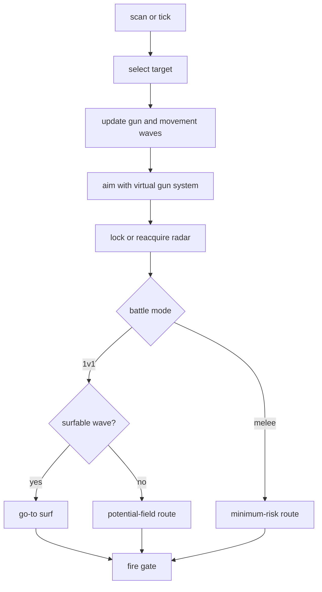

# Adaptive Prime

Adaptive Prime is the 1v1 champion candidate. It uses the full shared stack:
virtual guns, enemy-fire detection, go-to surfing, movement learning,
minimum-risk melee movement, and telemetry.

Shared references:

- [Shared Bot Systems](../../docs/bot-shared-systems.md)
- [Bot Core Data Structures](../../docs/bot-core-data-structures.md)
- [Tooling](../../docs/tooling.md)

Bot-specific tuning lives in policy dataclasses in `adaptive_prime.py`:
`GunPolicy`, `TraditionalGfPolicy`, `FirePolicy`, `TargetPolicy`,
`RadarPolicy`, `MovementPolicy`, and `DuelMovementPolicy`.

## Behavior



Adaptive is different from the other local bots in three places:

- It prefers go-to surfing when an enemy wave is usable.
- It falls back to potential-field routing in 1v1 instead of simple orbiting.
- It raises firepower more aggressively when gun confidence and energy position
  are good.

## Movement

1v1 movement priority:

1. Use shared go-to surfing when a wave can be scored.
2. Otherwise compute a potential-field destination from enemy repulsion,
   orbit tangent, fire-threat repulsion, wall repulsion, and center attraction.
3. Use distance bands to panic-open, open range, orbit, or reconnect.

Melee uses shared minimum-risk movement. In `track` telemetry this appears as
`movement_mode=melee_minimum_risk`.

Key movement telemetry:

- `movement.goto_surf`
- `movement.duel_potential`
- `movement.minimum_risk`
- `enemy.fire_detected`
- `enemy.gun_heat_wave`

## Guns

Normal selectable guns are `linear`, `dynamic_cluster`, `traditional_gf`, and
`displacement`.

Selector roles:

| Gun | Role |
| --- | --- |
| `dynamic_cluster` | Primary learning gun. |
| `displacement` | Situational history-replay gun. |
| `traditional_gf` | Situational profile gun with source-aware gates and a flight/lateral/wall-margin profile. |
| `linear` | Early/simple-motion fallback. |

Adaptive keeps bot-specific selector gates around the shared selector:

- KNN can warm up earlier than in shared defaults.
- Gun changes require a `0.08` score margin to limit context-driven oscillation.
- A fallback needs a `0.18` score margin to replace an active primary gun.
- Trusted Traditional GF segment sources can challenge early.
- Global or weak blended Traditional GF sources are penalized more heavily.
- Situational guns need context/source evidence or a KNN slump to displace KNN.
- Eval waves can add capped selector-only evidence without training production
  learners.

Adaptive's default Traditional GF model uses a gun-local key of flight time,
absolute lateral speed, and wall margin. It starts blending a segment after 8
effective visits and reaches full segment weight at 36 visits. The model uses
31 bins, smoothing `1.25`, decay `0.985`, and maximum-bin peak selection. This
configuration beat the former global-only control in all three 24-round Python
BasicGFSurfer repeats (`11.93%` versus `10.39%` hit rate). Superseded
Traditional-GF presets and tuning environment variables are intentionally not
supported. Profile learning still records the full escape range, while firing
is bounded to `|GF| <= 0.87` to exclude the unproductive extreme tail.

For isolated gun testing:

```sh
ROBOCODE_ADAPTIVE_GUN_MODE=displacement \
scripts/run-battle.sh --telemetry --rounds 24 \
  bots/adaptive-prime bots/ports/basic-gf-surfer-port
```

Useful experiment knobs:

```sh
ROBOCODE_ADAPTIVE_GUN_SET=linear,dynamic_cluster,traditional_gf,displacement
ROBOCODE_ADAPTIVE_GUN_EVAL=1
ROBOCODE_ADAPTIVE_GUN_EVAL_INTERVAL=1
```

Valid pinned guns are `head_on`, `linear`, `linear_wall_aware`,
`displacement`, `traditional_gf`, `dynamic_cluster`, and `anti_surfer`.

## Firepower

Adaptive is willing to spend power when close, ahead, or confident:

```text
last stand: up to 0.6 while leaving a small reserve
low energy: 0.6-0.8
finisher: target_energy / 3.5 + 0.2, clamped
close: 1.6-2.2
mid: 1.3-1.8 depending on confidence and energy lead
far: 0.8-1.0
```

The shared fire gate still requires fresh target data, alignment, valid
firepower, and enough energy after the shot. Adaptive uses the shared
`last_stand` path at critical energy instead of a separate KNN-gated low-energy
override, so aligned close shots can still fire below the normal energy margin.

## Analysis

Primary telemetry:

- `track`: target, radar, aim, movement, fire hold, and selected gun context.
- `gun.switch_decision`: selector candidates, scores, visits, thresholds,
  bonuses, penalties, and rejection reasons.
- `gun.wave_visit`: production virtual-gun scoring.
- `gun.eval_wave_visit`: optional neutral eval-wave scoring.
- `gun.traditional_gf_profile`: Traditional GF source/profile diagnostics.
- `bot.turn_timing` / `bot.skipped_turn`: decision-time budget and skipped tick
  diagnostics.

Preferred surfer check:

```sh
scripts/run-battle.sh --telemetry --rounds 24 \
  bots/adaptive-prime bots/ports/basic-gf-surfer-port

tools/telemetry_audit.py battle-results/runs/<run>/telemetry \
  --require-bot adaptive-prime
tools/combat_economics_summary.py battle-results/runs/<run>
tools/gun_eval_summary.py battle-results/runs/<run>/telemetry \
  --bot adaptive-prime --post-switch-shots 6
```

Use [Tooling](../../docs/tooling.md) for the full experiment workflow.
