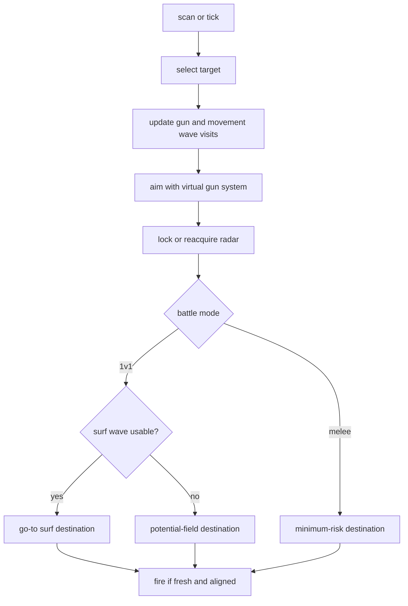
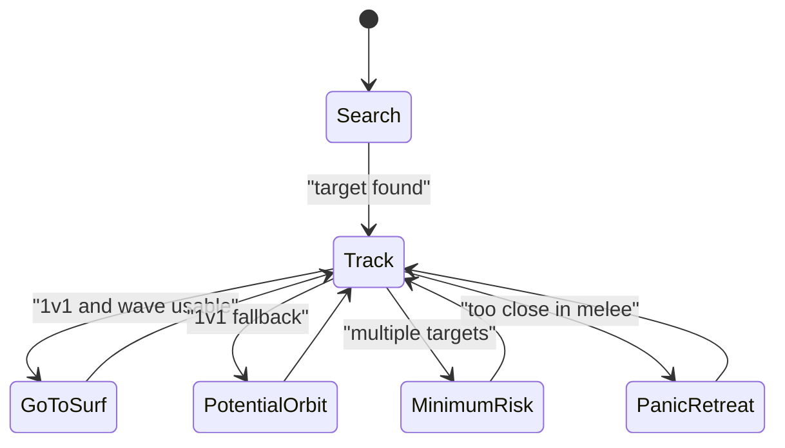

# Adaptive Prime

Adaptive Prime is the experimental 1v1 champion candidate. It uses nearly all
shared systems, but its distinctive behavior is adaptive movement selection:
go-to surfing first, potential-field routing second, and minimum-risk routing in
melee.

Shared systems are documented in:

- [Shared Bot Systems](../../docs/bot-shared-systems.md)
- [Bot Core Data Structures](../../docs/bot-core-data-structures.md)

## What Makes It Different

- 1v1-first movement stack.
- Uses go-to surfing when a surfable wave is available.
- Falls back to potential-field destination planning when surfing cannot choose
  a destination.
- Uses minimum-risk movement in melee instead of tunneling.
- Firepower scales more aggressively with learned gun confidence and energy
  advantage than Chase/Circle/Sweep.

## Turn Flow



## Movement Modes



### Go-To Surf

The bot asks the movement flattener for a destination that minimizes projected
wave danger, wall risk, range risk, and travel cost. The shared scorer is
documented in
[Bot Core Data Structures](../../docs/bot-core-data-structures.md#go-to-surfing).

Telemetry event: `movement.goto_surf`.

### Potential Field

When go-to surfing has no destination, Adaptive Prime computes a destination
from forces:

```text
force = enemy_repulsion
      + orbit_tangent
      + fire_threat_repulsion
      + wall_repulsion
      + center_attraction
```

Distance bands:

- `< DUEL_CRITICAL_DISTANCE`: panic-open range.
- `< DUEL_MIN_DISTANCE`: open range.
- near `DUEL_PREFERRED_DISTANCE`: orbit.
- `> DUEL_MAX_DISTANCE`: reconnect.

Telemetry event: `movement.duel_potential`.

### Melee Minimum Risk

When multiple targets are alive, Adaptive Prime uses shared minimum-risk
movement. This is intentionally less aggressive than Chase because survival and
crossfire avoidance matter more in melee.

Telemetry event: `movement.minimum_risk`.

## Firepower Policy

Adaptive Prime is the most willing bot to increase power when confidence is
good.

```text
low own energy:
  p = 0.8 close, else 0.6
finisher:
  p = clamp(target_energy / 3.5 + 0.2, 0.6, 2.2)
distance < 160:
  p = 2.2 if own energy > 36 else 1.6
distance < 280:
  p = 1.8
distance < 420:
  p = 1.6 with confidence/energy lead, else 1.3
distance < 620:
  p = 1.3 with strong confidence/energy lead, else 1.0
far:
  p = 0.8
```

## Key Telemetry

- `movement.goto_surf`: selected destination and danger breakdown.
- `movement.duel_potential`: force vector, mode, destination, and evasion flag.
- `movement.minimum_risk`: melee destination and risk.
- `enemy.gun_heat_wave`: expected enemy fire wave.
- `enemy.fire_detected`: confirmed enemy energy-drop fire.
- `track`: selected target, aim mode, movement mode, radar mode, and fire hold
  state.

Use [Tooling: Telemetry Viewer](../../docs/tooling.md#telemetry-viewer) for
launch, reset, audit, and stop commands.

## Tuning Checklist

- Standing still at close range: inspect `movement.goto_surf`,
  `movement.duel_potential`, `target_speed`.
- Weak damage: inspect `gun_confidence`, `gun_confidence_visits`, distance, own
  energy.
- Bad melee target tunneling: inspect `target.select`, `known_targets`,
  `movement.minimum_risk`.
- Late dodge: compare `enemy.gun_heat_wave` with `enemy.fire_detected`.
