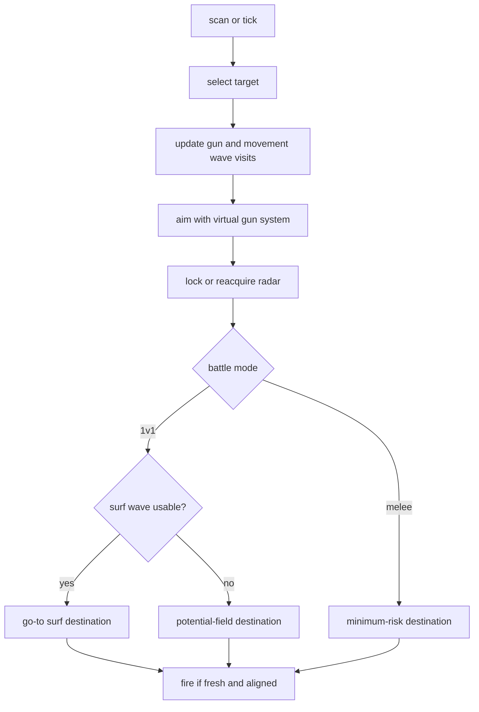
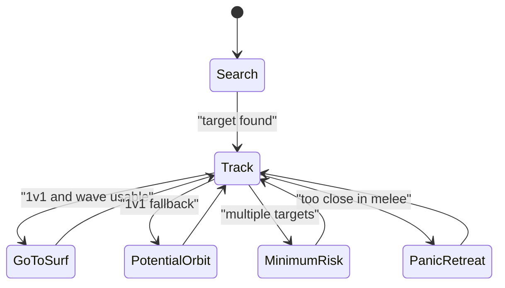

# Adaptive Prime

Adaptive Prime is the experimental 1v1 champion candidate. It uses nearly all
shared systems, but its distinctive behavior is adaptive movement selection:
go-to surfing first, potential-field routing second, and minimum-risk routing in
melee.

Shared systems are documented in:

- [Shared Bot Systems](../../docs/bot-shared-systems.md)
- [Bot Core Data Structures](../../docs/bot-core-data-structures.md)

Adaptive Prime keeps its personality in small module-level policy dataclasses:
`GunPolicy`, nested `TraditionalGfPolicy`, `FirePolicy`, `TargetPolicy`,
`RadarPolicy`, `MovementPolicy`, and `DuelMovementPolicy`. These group tuning
values by responsibility without moving bot-specific thresholds into shared
`bot_core`.

## What Makes It Different

- 1v1-first movement stack.
- Uses go-to surfing when a surfable wave is available.
- Falls back to potential-field destination planning when surfing cannot choose
  a destination.
- Uses minimum-risk movement in melee instead of tunneling.
- Firepower scales more aggressively with learned gun confidence and energy
  advantage than Chase/Circle/Sweep.

## Turn Flow



## Movement Modes



### Go-To Surf

The bot asks the movement flattener for a destination that minimizes projected
wave danger, wall risk, range risk, and travel cost. The shared scorer is
documented in
[Bot Core Data Structures](../../docs/bot-core-data-structures.md#go-to-surfing).

Telemetry event: `movement.goto_surf`.

### Potential Field

When go-to surfing has no destination, Adaptive Prime computes a destination
from forces:

```text
force = enemy_repulsion
      + orbit_tangent
      + fire_threat_repulsion
      + wall_repulsion
      + center_attraction
```

Distance bands:

- `< DuelMovementPolicy.critical_distance`: panic-open range.
- `< DuelMovementPolicy.min_distance`: open range.
- near `DuelMovementPolicy.preferred_distance`: orbit.
- `> DuelMovementPolicy.max_distance`: reconnect.

Telemetry event: `movement.duel_potential`.

### Melee Minimum Risk

When multiple targets are alive, Adaptive Prime uses shared minimum-risk
movement. This is intentionally less aggressive than Chase because survival and
crossfire avoidance matter more in melee.

Telemetry event: `movement.minimum_risk`. In `track` events this branch appears
as movement mode `melee_minimum_risk`.

## Firepower Policy

Adaptive Prime is the most willing bot to increase power when confidence is
good.

```text
low own energy:
  p = 0.8 close, else 0.6
finisher:
  p = clamp(target_energy / 3.5 + 0.2, 0.6, 2.2)
distance < 160:
  p = 2.2 if own energy > 36 else 1.6
distance < 280:
  p = 1.8
distance < 420:
  p = 1.6 with confidence/energy lead, else 1.3
distance < 620:
  p = 1.3 with strong confidence/energy lead, else 1.0
far:
  p = 0.8
```

## Gun Policy

Adaptive Prime uses a bot-specific `GunPolicy` to make virtual-gun switching
less linear-biased than the shared defaults. Traditional GF's larger tuning
surface is grouped under `TraditionalGfPolicy`:

- `dynamic_cluster` can warm up earlier through lower KNN sample, score, and
  switch visit thresholds and is labeled as the primary learning gun.
- `traditional_gf` is treated as a situational profile gun. Its trusted
  exact/coarse sources can challenge KNN early, while weak global sources stay
  more conservative.
- If primary KNN is in a low-score slump after enough visits, trusted
  Traditional GF sources get a smaller challenge margin. If a Traditional GF
  trial degrades to global-only source, the selector lowers its retention
  advantage while still requiring replacement guns to pass their normal gates.
- `traditional_gf` uses exact and coarse segmented guess-factor profile
  blending with global fallback from the shared gun defaults, so the actual
  bearing can track current movement context without waiting too long for
  exact-segment samples.
- `traditional_gf` uses source-aware selector gates and trust penalties:
  global profile shots need more visits and a higher adjusted score, blended
  sources interpolate toward trusted gates as segment weight grows, and
  exact/coarse segment sources can switch earliest.
- `traditional_gf` uses the shared density-supported peak selection and
  source-specific centering for lower-trust global/coarse sources to reduce
  sparse-profile over-aiming.
- Melee keeps segmented gun stats and live `traditional_gf` bearings disabled;
  `traditional_gf` candidates can appear as unavailable in switch diagnostics.
- Adaptive's normal selectable gun modes are `linear`, `traditional_gf`, and
  `dynamic_cluster`. `displacement` and `anti_surfer` are still built by the
  standard runtime and can be forced for isolated experiments, but they are not
  part of Adaptive's normal selectable-mode set.
- Switching uses a small confidence penalty until a mode has enough virtual
  visits. The shared selector also applies trait-based priors: KNN gets a
  maturity bonus and can match nonlinear/adaptive movement history, linear is
  penalized unless current or recent target motion matches its simple movement
  strengths, and profile guns can match trusted source contexts plus
  stable-pattern history.
  `gun.switch_decision` reports adjusted `score`, `raw_score`, and
  `decision_bonus` so score-vs-hit calibration can separate weak evidence from
  heuristic preference. When eval waves are enabled, the selector can also use
  capped `eval_score_bonus` and partial `effective_visits` credit without
  feeding eval visits into the production learners.

For isolated gun testing, set:

```sh
ROBOCODE_ADAPTIVE_GUN_MODE=traditional_gf scripts/run-battle.sh --rounds 8 bots/adaptive-prime bots/chase-lock
```

Valid values are `linear`, `displacement`, `traditional_gf`,
`dynamic_cluster`, and `anti_surfer`. A forced gun is used only on ticks where
that gun has enough data to produce an aim bearing; otherwise the selector
falls back to an available mode. `displacement` and `anti_surfer` are included
here for isolated experiments even though they are outside Adaptive's normal
selectable-mode set.

For `traditional_gf` modeling experiments, Adaptive also accepts:

```sh
ROBOCODE_ADAPTIVE_TRADITIONAL_GF_MIN_SAMPLES=12 \
ROBOCODE_ADAPTIVE_TRADITIONAL_GF_GLOBAL_SOURCE_CENTERING_FACTOR=0.8 \
ROBOCODE_ADAPTIVE_TRADITIONAL_GF_COARSE_SOURCE_CENTERING_FACTOR=0.7 \
ROBOCODE_ADAPTIVE_TRADITIONAL_GF_COARSE_BLEND_SOURCE_CENTERING_FACTOR=0.8 \
ROBOCODE_ADAPTIVE_TRADITIONAL_GF_COARSE_SEGMENT_MIN_SAMPLES=12 \
ROBOCODE_ADAPTIVE_TRADITIONAL_GF_COARSE_SEGMENT_FULL_WEIGHT_SAMPLES=48 \
ROBOCODE_ADAPTIVE_TRADITIONAL_GF_PEAK_SELECTION=density \
ROBOCODE_ADAPTIVE_GUN_MODE=traditional_gf \
scripts/run-battle.sh --telemetry --rounds 12 bots/adaptive-prime --legacy basic-gf-surfer
```

Use these as telemetry sweep knobs before changing committed defaults. Core
Traditional GF values such as smoothing, decay, exact segment thresholds,
source penalties, and peak support radius come from the shared
`TraditionalGfGunConfig`; Adaptive only overrides its selector gates and the
experiment knobs listed above. The coarse key is fixed in code to distance,
lateral speed, and wall margin. Source centering factors pull sparse/global
profile peaks toward head-on without changing trusted segment sources. Peak
selection uses `density` by default; `max` remains available for strongest-bin
comparisons.

For neutral gun-evaluation telemetry, set:

```sh
ROBOCODE_ADAPTIVE_GUN_EVAL=1 scripts/run-battle.sh --telemetry --rounds 24 bots/adaptive-prime --legacy basic-gf-surfer
```

This emits `gun.eval_wave_visit` at fresh, gun-ready opportunities. Eval-wave
stats are separate from production `gun.wave_visit` stats and concrete gun
learners. They can provide selector-only decision evidence after enough eval
visits. Use `ROBOCODE_ADAPTIVE_GUN_EVAL_INTERVAL=1` for denser analysis when
telemetry volume is acceptable.

Use `tools/gun_eval_summary.py <telemetry-dir> --bot adaptive-prime
--post-switch-shots 6` to compare switch-time score/visits, production
wave averages, eval-wave averages, GF error, real post-switch hit rate, and
Traditional GF real hit rate by profile source. The summary also reports
Traditional GF profile-weight diagnostics and GF error grouped by profile
source, so coarse-key experiments can separate high virtual score from real
source conversion. Its calibration table reports adjusted score, raw score,
confidence/source penalties, selected-source counts, and score-vs-hit gaps.
Treat `eval_hit_gap` as diagnostic evidence only; eval waves are not direct
proof that a mode should switch live.

For gun modeling and selector calibration follow-up, check the research notes
in [docs/plans](../../docs/plans/README.md), especially the
confidence-calibrated selector plan, before changing committed selector or
Traditional GF defaults.

## Key Telemetry

- `movement.goto_surf`: selected destination and danger breakdown.
- `movement.duel_potential`: force vector, mode, destination, and evasion flag.
- `movement.minimum_risk`: melee destination and risk. In `track` events this
  branch appears as movement mode `melee_minimum_risk`.
- `enemy.gun_heat_wave`: expected enemy fire wave.
- `enemy.fire_detected`: confirmed enemy energy-drop fire.
- `gun.switch_decision`: sampled selector diagnostics, including candidate
  scores, visits, thresholds, margin, and rejection reason.
- `gun.traditional_gf_profile`: sampled global/segment traditional-GF profile
  diagnostics emitted periodically, including during forced-gun tests.
- `track`: selected target, aim mode, movement mode, radar mode, and fire hold
  state. When `traditional_gf` is available, includes `traditional_gf_*`
  fields for global/segment GF peaks, blend, selected GF, and source.

Use [Tooling: Telemetry Viewer](../../docs/tooling.md#telemetry-viewer) for
launch, reset, audit, and stop commands.

## Tuning Checklist

- Standing still at close range: inspect `movement.goto_surf`,
  `movement.duel_potential`, `target_speed`.
- Weak damage: inspect `gun_confidence`, `gun_confidence_visits`, distance, own
  energy.
- Bad melee target tunneling: inspect `target.select`, `known_targets`,
  `movement.minimum_risk`.
- Late dodge: compare `enemy.gun_heat_wave` with `enemy.fire_detected`.
