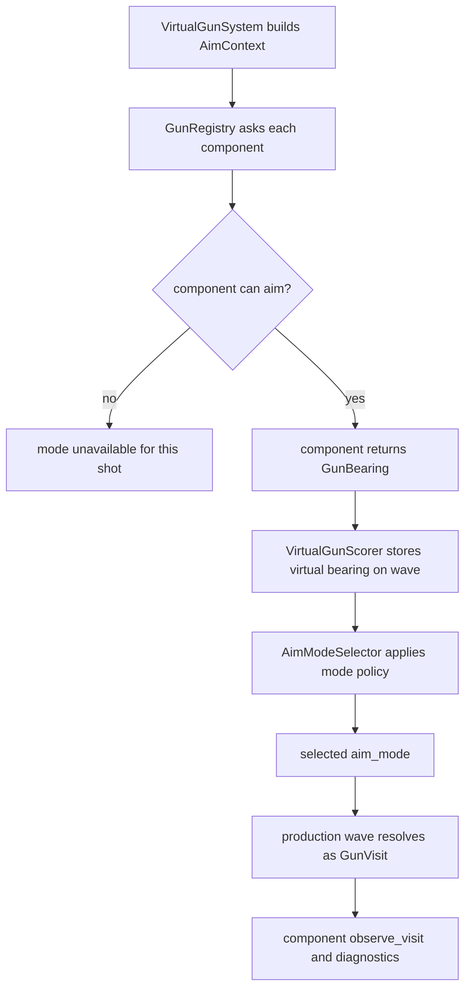

# Gun Components

Concrete virtual gun components live in this package. `bot_core.gun.system`
orchestrates aiming, wave lifecycle, scoring, switching, and telemetry; each
sub-package owns one aiming model and the state needed to learn or explain that
model.

## Component Contract

Every gun implements `GunComponent` from `base.py`:

- `aim(context)` returns a `GunBearing` or `None` when the gun is unavailable.
- `observe_visit(visit)` learns from resolved production visits when the gun
  has state.
- `visit_diagnostics(visit)` returns per-wave diagnostics for telemetry and
  tools.
- `metrics()`, `clear_round_state()`, and `remove_target()` expose lifecycle
  hooks to the facade.

Mode-specific selector thresholds and generic labels belong to the component
configuration through `GunModePolicy` and `GunModeTraits`. Components should
prefer shared `AimContext.movement_tags` over static movement labels when
building decision context. The selector should not need concrete-gun branches;
it uses role, family, phase, strengths, and generic decision context to apply
priors.

## Runtime Flow

## Packages

| Package | Mode | State owner |
| --- | --- | --- |
| [`head_on`](head_on/README.md) | `head_on` | Stateless direct bearing. |
| [`linear`](linear/README.md) | `linear` | Stateless linear intercept prediction. |
| [`displacement`](displacement/README.md) | `displacement` | Reads shared target history, no private learner. |
| [`dynamic_cluster`](dynamic_cluster/README.md) | `dynamic_cluster` | Owns KNN sample memory. |
| [`traditional_gf`](traditional_gf/README.md) | `traditional_gf` | Owns global and fixed flight/lateral/wall-margin GF profiles. |

`factory.standard_runtime_config()` wires the standard bot gun set. Add a
sub-package README whenever a new concrete gun is introduced.
