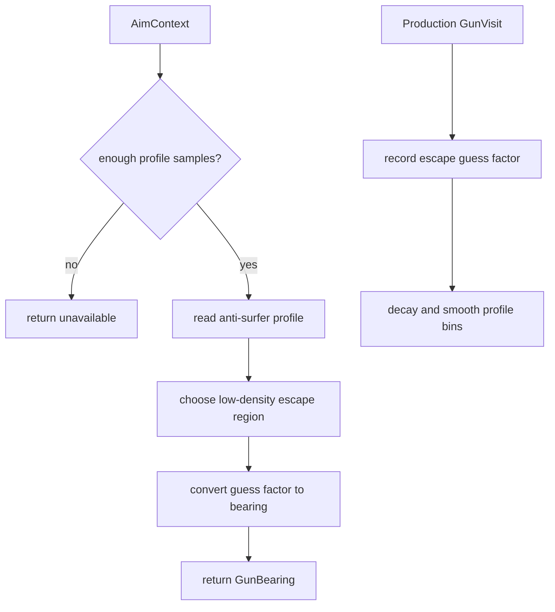

# Anti-Surfer Gun

Mode: `anti_surfer`

The anti-surfer gun is a profile-backed guess-factor gun intended to aim at
historical low-density escape regions instead of the strongest observed peak. It
is useful as a hedge against opponents that surf or bias away from common
guess-factor aim points.

## Package Contents

- `gun.py`: `AntiSurferGun`, the concrete `GunComponent`.
- `config.py`: `AntiSurferGunConfig`, including profile smoothing, decay,
  bins, and selector policy thresholds.
- `profile.py`: component-local guess-factor profile storage and lookup.

## Runtime Behavior

`AntiSurferGun` records production wave visits into profile bins and returns a
guess-factor bearing once enough samples exist. It owns its learner and target
cleanup, so orchestration code only passes `AimContext` and `GunVisit`.

The default selector policy is supplied by `AntiSurferGunConfig.mode_policy()`.
Tuning switch thresholds or sample requirements belongs in the config, not in
`VirtualGunSystem` or `AimModeSelector`.

## Behavior Flow

## Telemetry Notes

The gun contributes normal virtual-gun wave scores through `gun.wave_visit` and
normal selection diagnostics through `gun.switch_decision`. Package-specific
metrics should be added through `visit_diagnostics()` or `metrics()` so tools
can consume them without importing the concrete class.
