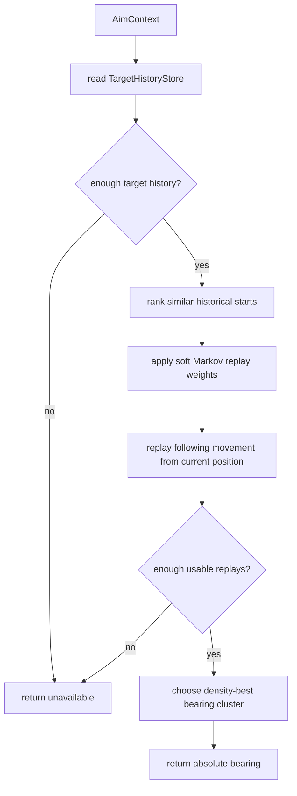

# Displacement Gun

Mode: `displacement`

The displacement gun predicts the target with rotation-normalized play-it-forward
replay. It finds historical target states that resemble the current state,
replays the following historical movement from the current target position, and
rotates each replay step from the old heading frame into the current heading
frame. It is a lightweight pattern gun that depends on shared target history
rather than owning a private learner.

## Package Contents

- `gun.py`: `DisplacementGun`, the concrete `GunComponent`.
- `config.py`: `DisplacementGunConfig`, including sample count and selector
  policy thresholds. `markov_enabled` defaults to `True` and can be disabled
  by bot wiring for density-only validation runs.

## Runtime Behavior

`DisplacementGun` reads `TargetHistoryStore` from the runtime context. For a
target, it ranks historical start snapshots by similarity to the current enemy
state: speed, observed lateral speed, observed advancing speed, observed wall
margin, observed flight-time bucket, and recent heading-change bucket. Absolute
heading difference is a small tie-breaker because replay steps are rotated into
the current heading frame. A small order-2 symbolic Markov model adds soft
weighting for candidates whose recent movement rhythm matches the current
target rhythm.

For each usable candidate, the gun replays subsequent historical movement from
the current enemy position until bullet travel catches the replayed position.
Movement is normalized by heading, so an old forward-left step is replayed as
forward-left relative to the current enemy heading instead of copied as raw
world-space `dx/dy`. The final aim uses density-best relative-bearing
selection: it finds the strongest local cluster of replay bearings and returns a
weighted centroid around that peak instead of taking the median across all
usable replays.

The gun returns `None` until enough usable history exists. That unavailable
state is expected and should be represented through normal switch diagnostics,
not special-case selector code.

## Behavior Flow

## Telemetry Notes

Displacement has no private hit learner. It is scored by the shared virtual-gun
wave scorer and appears in `gun.wave_visit`, `gun.switch_decision`, and
`aim_mode` when selected. Its `GunBearing.metadata` and wave diagnostics expose
replay quality signals such as replay count, best candidate score, peak density,
peak share, bearing spread, distance bucket, Markov order, Markov match count,
Markov confidence, Markov entropy, and best next movement symbol.

## Validation Notes

The July 2026 forced BasicGFSurfer check kept Markov weighting enabled by
default. A same-size density-only run (`markov_enabled=False`) had similar
filtered displacement hit rate but worse raw and filtered score/first-place
results, so Markov remains a soft default-on ranking signal rather than a
separate gun mode.
