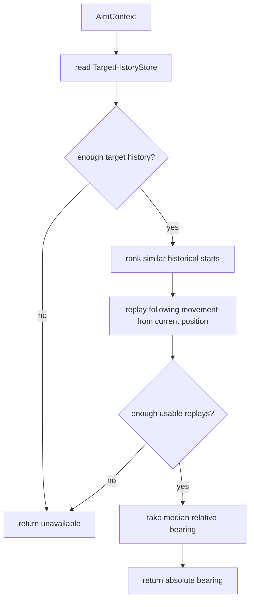

# Displacement Gun

Mode: `displacement`

The displacement gun predicts the target with rotation-normalized play-it-forward
replay. It finds historical target states that resemble the current state,
replays the following historical movement from the current target position, and
rotates each replay step from the old heading frame into the current heading
frame. It is a lightweight pattern gun that depends on shared target history
rather than owning a private learner.

## Package Contents

- `gun.py`: `DisplacementGun`, the concrete `GunComponent`.
- `config.py`: `DisplacementGunConfig`, including sample count and selector
  policy thresholds.

## Runtime Behavior

`DisplacementGun` reads `TargetHistoryStore` from the runtime context. For a
target, it ranks historical start snapshots by similarity to the current enemy
state: heading, speed, lateral speed, advancing speed, and wall margin. For each
usable candidate, it replays subsequent historical movement from the current
enemy position until bullet travel catches the replayed position. Movement is
normalized by heading, so an old forward-left step is replayed as forward-left
relative to the current enemy heading instead of copied as raw world-space
`dx/dy`. The final aim uses the median relative bearing from usable replays.

The gun returns `None` until enough usable history exists. That unavailable
state is expected and should be represented through normal switch diagnostics,
not special-case selector code.

## Behavior Flow

## Telemetry Notes

Displacement has no private hit learner. It is scored by the shared virtual-gun
wave scorer and appears in `gun.wave_visit`, `gun.switch_decision`, and
`aim_mode` when selected.
