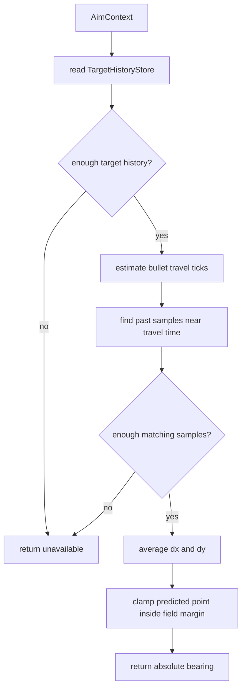

# Displacement Gun

Mode: `displacement`

The displacement gun predicts the target by averaging historical movement
offsets that match the current bullet travel time. It is a lightweight pattern
gun that depends on shared target history rather than owning a private learner.

## Package Contents

- `gun.py`: `DisplacementGun`, the concrete `GunComponent`.
- `config.py`: `DisplacementGunConfig`, including sample count, time tolerance,
  and selector policy thresholds.

## Runtime Behavior

`DisplacementGun` reads `TargetHistoryStore` from the runtime context. For a
target, it compares the current sample with past samples whose elapsed ticks are
within `time_tolerance` of the current bullet travel estimate. If enough matches
exist, it averages their x/y displacement, clamps the predicted point inside the
field margin, and returns an absolute bearing.

The gun returns `None` until enough usable history exists. That unavailable
state is expected and should be represented through normal switch diagnostics,
not special-case selector code.

## Behavior Flow

## Telemetry Notes

Displacement has no private hit learner. It is scored by the shared virtual-gun
wave scorer and appears in `gun.wave_visit`, `gun.switch_decision`, and
`aim_mode` when selected.
