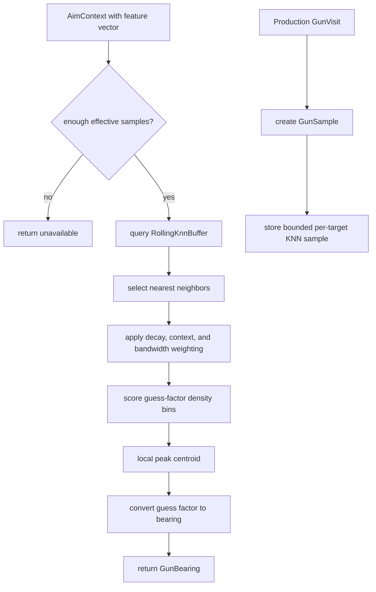

# Dynamic Cluster Gun

Mode: `dynamic_cluster`

The dynamic-cluster gun is the KNN-backed guess-factor model. It learns target
escape samples from resolved production waves and selects a bearing from nearby
feature-space samples.

## Package Contents

- `gun.py`: `DynamicClusterGun`, the concrete `GunComponent`.
- `config.py`: `DynamicClusterGunConfig`, including sample caps, neighbor
  count, bandwidth, decay, warmup, bins, and selector policy thresholds.
- `memory.py`: `RollingKnnBuffer`, the bounded per-target sample store.

## Runtime Behavior

`DynamicClusterGun` owns KNN memory and sample sequencing. It consumes
`GunVisit` production results, stores `GunSample` records in `RollingKnnBuffer`,
and computes a guess factor from nearest neighbors when enough effective samples
are available. Samples carry the shared fire context collected at aim time:
movement tags, bullet flight time, lateral-direction confidence, and
wall-limited escape shape.

Neighbor selection still starts from the existing normalized feature tuple.
Context-aware weighting then softly adjusts neighbor influence, preferring
similar tags, flight time, wall-escape balance, and confident lateral direction
without hard-filtering samples.

Aim extraction scores the usual guess-factor density bins, then refines the
best bin with a local weighted centroid of nearby neighbor samples. Bandwidth
is adjusted by target hit width, and component diagnostics report peak margin,
neighbor agreement, aim confidence, ambiguity, and the selected guess factor.
`DynamicClusterGunConfig` owns the density bandwidth, second-peak suppression,
centroid window, context-weight clamp, ambiguity ratio/centering, and confidence
inputs so tuning can be tested without changing the component algorithm. The
default only mildly centers highly ambiguous peaks (`ratio >= 0.85`) so the gun
remains the primary KNN aim model rather than being hidden by selector policy.

Shot-quality diagnostics combine aim confidence, neighbor agreement, ambiguity,
wall-escape stability, and lateral confidence. They report a quality reason and
recommended power scale. The rejected GF-softening experiment was removed, so
shot quality affects firepower policy only.

The failed online calibration apply-correction experiment was removed from the
gun and telemetry. Do not emit telemetry for calibration corrections unless a
real calibration behavior is reintroduced and validated.

Each live bot exposes experiment-only env overrides for those dynamic-cluster
knobs through its own prefix: `ROBOCODE_ADAPTIVE_DYNAMIC_*`,
`ROBOCODE_CHASE_DYNAMIC_*`, `ROBOCODE_CIRCLE_DYNAMIC_*`, or
`ROBOCODE_SWEEP_DYNAMIC_*`. Use them through
`scripts/run-ab.sh --candidate-env ...` for sweeps; do not treat an env-only
result as a shared default promotion until filtered 20+ round surfer results or
matching bot-specific evidence support it.

`<PREFIX>_DYNAMIC_PRESET` accepts `current` or `simple_knn`. The opt-in
`simple_knn` control uses fixed `0.18` bandwidth, best-bin aim without centroid
refinement, no ambiguity centering, no context weighting, and no shot-quality
power scaling. It is an experiment control, not a production default. Geometry
experiments can also set `<PREFIX>_DYNAMIC_MIN_SAMPLES`,
`_BLEND_SAMPLES`, `_NEIGHBORS`, `_DECAY_HALF_LIFE`,
`_MIN_EFFECTIVE_SAMPLES`, and `_GUESS_FACTOR_BINS`. Explicit knob values
override the selected preset.

The component handles warmup and availability itself. The facade only asks for a
`GunBearing` and publishes visits back through the component contract.

## Behavior Flow

## Telemetry Notes

Dynamic-cluster diagnostics should remain component-owned. The shared scorer
records wave score and selection data, while component-specific fields belong in
`visit_diagnostics()` or `metrics()`. Wave-visit telemetry reports neighbor
count, feature-distance range, tag-match ratio, flight-time spread,
wall-escape spread, lateral confidence, density score, effective bandwidth,
best-bin guess factor, peak margin, neighbor agreement, aim confidence, peak
ambiguity, selected guess factor, and shot-quality recommendations.
