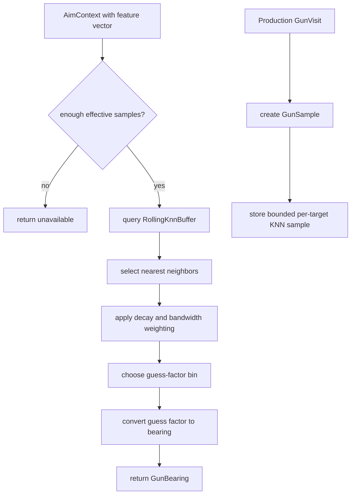

# Dynamic Cluster Gun

Mode: `dynamic_cluster`

The dynamic-cluster gun is the KNN-backed guess-factor model. It learns target
escape samples from resolved production waves and selects a bearing from nearby
feature-space samples.

## Package Contents

- `gun.py`: `DynamicClusterGun`, the concrete `GunComponent`.
- `config.py`: `DynamicClusterGunConfig`, including sample caps, neighbor
  count, bandwidth, decay, warmup, bins, and selector policy thresholds.
- `memory.py`: `RollingKnnBuffer`, the bounded per-target sample store.

## Runtime Behavior

`DynamicClusterGun` owns KNN memory and sample sequencing. It consumes
`GunVisit` production results, stores `GunSample` records in `RollingKnnBuffer`,
and computes a guess factor from nearest neighbors when enough effective samples
are available.

The component handles warmup and availability itself. The facade only asks for a
`GunBearing` and publishes visits back through the component contract.

## Behavior Flow

## Telemetry Notes

Dynamic-cluster diagnostics should remain component-owned. The shared scorer
records wave score and selection data, while component-specific fields belong in
`visit_diagnostics()` or `metrics()`.
