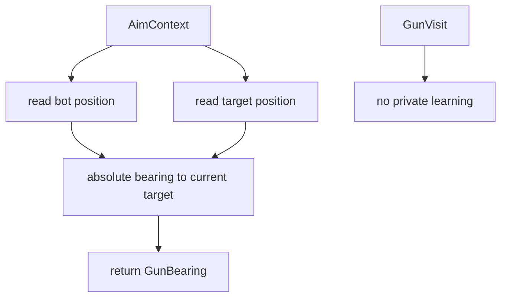

# Head-On Gun

Mode: `head_on`

The head-on gun aims directly at the target's current position. It is the
simplest baseline gun and is always available when a current target snapshot is
available.

## Package Contents

- `gun.py`: `HeadOnGun`, the concrete `GunComponent`.

## Runtime Behavior

`HeadOnGun` computes the absolute bearing from the bot position to the current
target position. It does not learn from visits, own target state, or emit
package-specific diagnostics.

Its selector floor is intentionally higher than the standard adaptive guns by
default. `factory.standard_runtime_config()` passes the default
`head_on_min_switch_score`, keeping that policy at runtime wiring rather than in
the selector.

## Behavior Flow

## Telemetry Notes

Head-on is scored by the shared virtual-gun wave scorer. It can appear in
`gun.wave_visit`, `gun.switch_decision`, and `aim_mode`, but has no private
diagnostic event.
