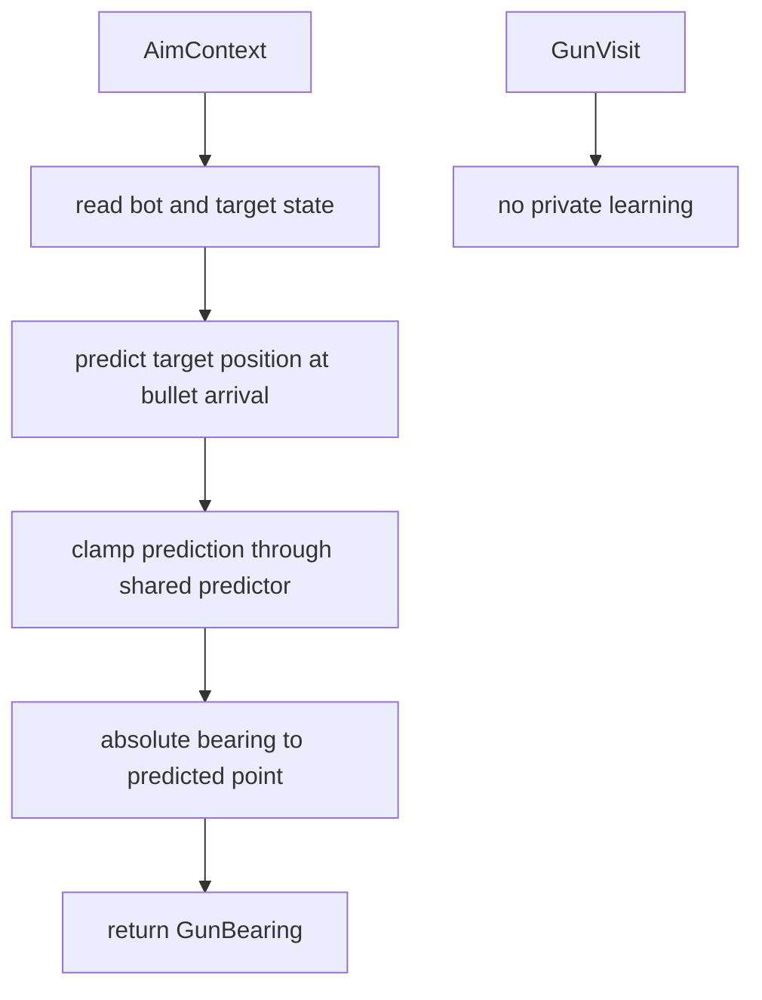

# Linear Gun

Mode: `linear`

The linear gun predicts an intercept point by assuming the target continues with
its current velocity. It is the default practical baseline for moving targets.

## Package Contents

- `gun.py`: `LinearGun`, the concrete `GunComponent`.

## Runtime Behavior

`LinearGun` calls the shared gun predictor with the current bot snapshot,
target snapshot, firepower, and field margin, then returns the absolute bearing
to the predicted point. It has no private learner or per-target state.

Selector thresholds are supplied when the component is constructed. Standard
runtime wiring uses the shared `min_switch_visits` and `min_switch_score`
values from `factory.standard_runtime_config()`.

## Behavior Flow

## Telemetry Notes

Linear is scored by the shared virtual-gun wave scorer. It can appear in
`gun.wave_visit`, `gun.switch_decision`, and `aim_mode`, but has no private
diagnostic event.
