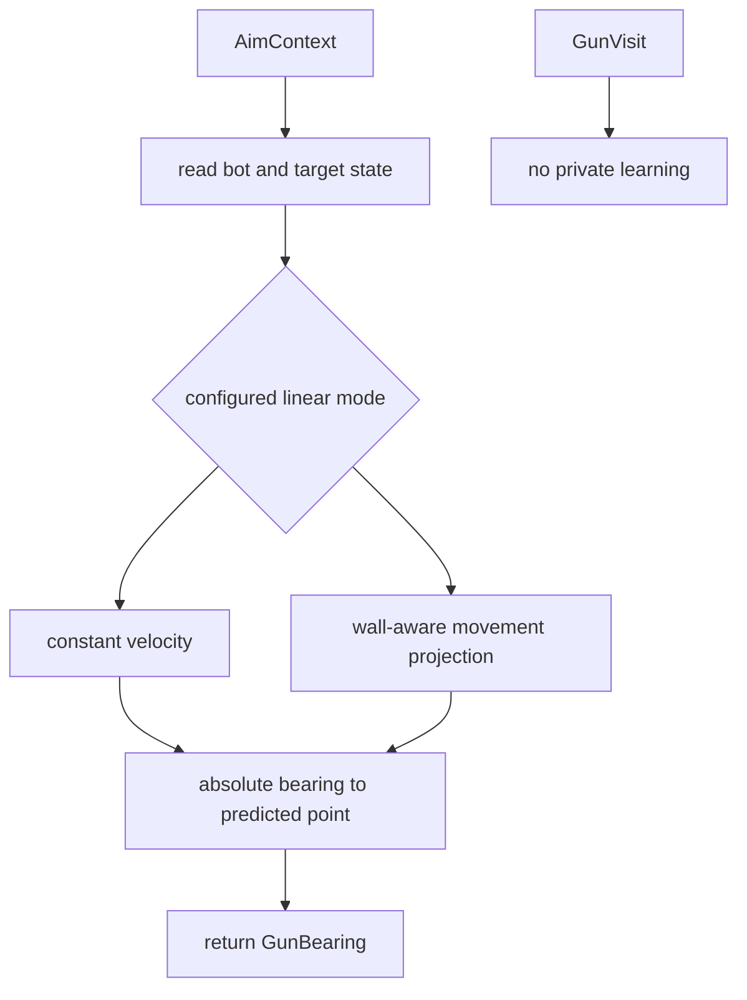

# Linear Gun

Modes: `linear`, `linear_wall_aware`

The linear gun family predicts an intercept point from the target's current
motion. `linear` assumes constant velocity and remains the default practical
baseline for moving targets. `linear_wall_aware` is a force-testable variant
for comparing wall-hit-aware prediction against the baseline.

## Package Contents

- `gun.py`: `LinearGun`, the concrete `GunComponent`.

## Runtime Behavior

`LinearGun` calls the shared gun predictor for its configured mode with the
current bot snapshot, target snapshot, firepower, and field margin, then returns
the absolute bearing to the predicted point. It has no private learner or
per-target state.

Selector thresholds are supplied when the component is constructed. Standard
runtime wiring uses the shared `min_switch_visits` and `min_switch_score`
values from `factory.standard_runtime_config()`.

## Behavior Flow

## Telemetry Notes

Linear is scored by the shared virtual-gun wave scorer. It can appear in
`gun.wave_visit`, `gun.switch_decision`, and `aim_mode`, but has no private
diagnostic event.
