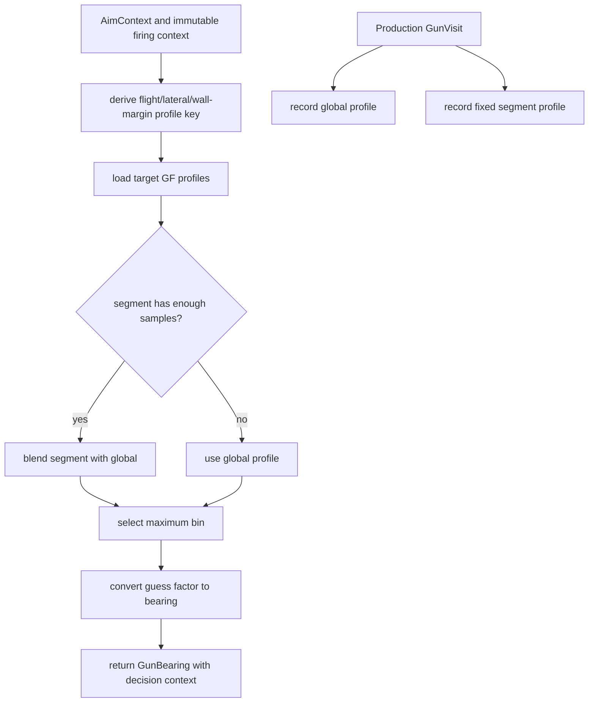

# Traditional Guess-Factor Gun

Mode: `traditional_gf`

The traditional guess-factor gun is a profile-backed gun that records target
escape guess factors into decayed histograms. It keeps global profiles and,
for each target, records compact flight-time/lateral-speed/wall-margin segment
profiles for blended context-aware aiming.

## Package Contents

- `gun.py`: `TraditionalGfGun`, the concrete `GunComponent`.
- `config.py`: `TraditionalGfGunConfig`, including sample thresholds,
  smoothing, decay, segment weights, and source-trust selector penalties.
- `profile.py`: component-local guess-factor profile storage and lookup.
- `diagnostics.py`: `TraditionalGfDiagnostics`, the structured model
  diagnostics emitted for tooling.

## Runtime Behavior

`TraditionalGfGun` owns all GF profile state. Production visits always update
the global profile and the fixed compact segment profile. Aiming selects a
profile source, computes a guess factor, and
returns a `GunBearing` with generic decision context so `AimModeSelector` can
apply mode policy without importing this package.

Global profile aiming is the fallback. A segment begins blending after eight
effective visits and reaches full weight at 36. Both profiles use 31 bins,
maximum-bin selection, smoothing `1.25`, and decay `0.985`.

Bots may optionally configure source-aware selector gates. When enabled,
global, blended, and trusted segment sources can report different
minimum-switch visits and score floors through the generic gun decision
context.

The segment key is fixed to flight time, absolute lateral speed, and wall
margin from immutable firing context. The same key is captured for aiming and
reused when the production wave visits, so training cannot drift into another
cell. Superseded coarse profiles, alternate keys, density peaks, source
centering, and experiment presets have been removed.

## Behavior Flow

## Telemetry Notes

Traditional GF has extra model telemetry because profile-source trust is
tunable. `gun.traditional_gf_profile` and `tools/gun_eval_summary.py` consume
the diagnostics owned by this package. Keep new Traditional GF fields local to
`diagnostics.py`, `visit_diagnostics()`, or `GunBearing.decision_context` unless
they are part of the shared gun contract.
