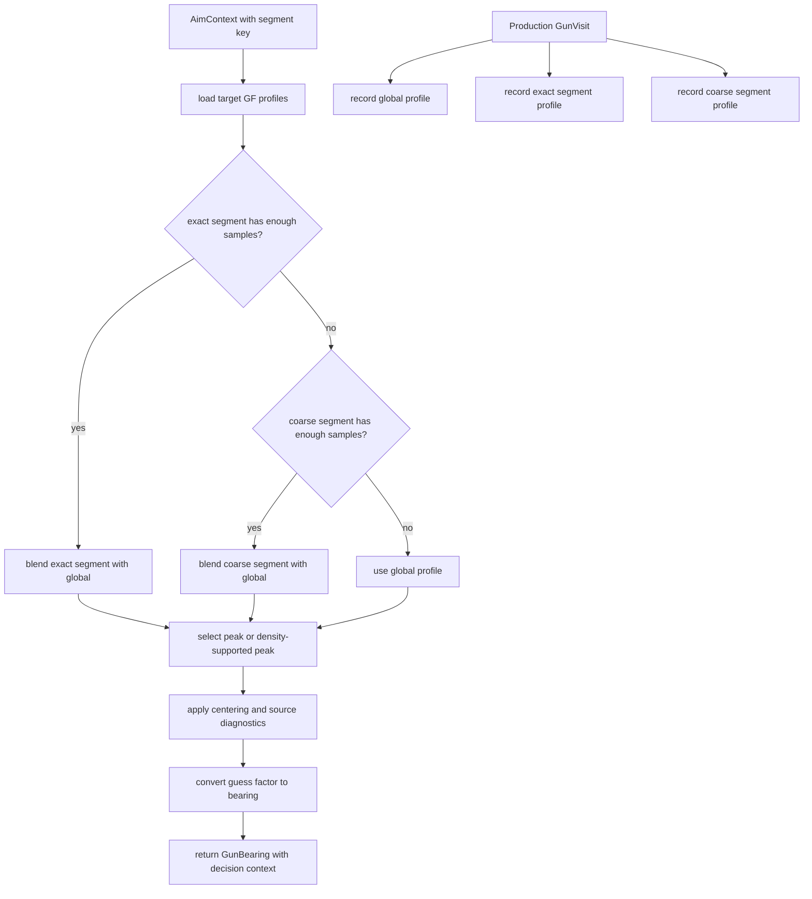

# Traditional Guess-Factor Gun

Mode: `traditional_gf`

The traditional guess-factor gun is a profile-backed gun that records target
escape guess factors into decayed histograms. It keeps global profiles and can
blend exact or coarse segment profiles when enough contextual samples exist.

## Package Contents

- `gun.py`: `TraditionalGfGun`, the concrete `GunComponent`.
- `config.py`: `TraditionalGfGunConfig`, including sample thresholds,
  smoothing, decay, segment weights, peak selection, and source-trust selector
  penalties.
- `profile.py`: component-local guess-factor profile storage and lookup.
- `diagnostics.py`: `TraditionalGfDiagnostics`, the structured model
  diagnostics emitted for tooling.

## Runtime Behavior

`TraditionalGfGun` owns all GF profile state. Production visits update global,
exact-segment, and coarse-segment profiles as applicable. Aiming selects a
profile source, computes a guess factor, and returns a `GunBearing` with generic
decision context so `AimModeSelector` can apply mode policy without importing
this package.

Global profile aiming is the fallback. Exact segment and coarse segment logic
belong here, including blend weights, density/peak selection, centering, and
source diagnostics.

## Behavior Flow

## Telemetry Notes

Traditional GF has extra model telemetry because profile-source trust is
tunable. `gun.traditional_gf_profile` and `tools/gun_eval_summary.py` consume
the diagnostics owned by this package. Keep new Traditional GF fields local to
`diagnostics.py`, `visit_diagnostics()`, or `GunBearing.decision_context` unless
they are part of the shared gun contract.
