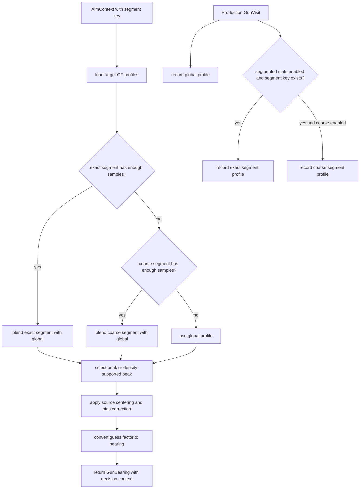

# Traditional Guess-Factor Gun

Mode: `traditional_gf`

The traditional guess-factor gun is a profile-backed gun that records target
escape guess factors into decayed histograms. It keeps global profiles and,
when segmented gun stats are available, records exact and coarse segment
profiles for blended context-aware aiming.

## Package Contents

- `gun.py`: `TraditionalGfGun`, the concrete `GunComponent`.
- `config.py`: `TraditionalGfGunConfig`, including sample thresholds,
  smoothing, decay, segment weights, peak selection, and source-trust selector
  penalties.
- `profile.py`: component-local guess-factor profile storage and lookup.
- `diagnostics.py`: `TraditionalGfDiagnostics`, the structured model
  diagnostics emitted for tooling.

## Runtime Behavior

`TraditionalGfGun` owns all GF profile state. Production visits always update
the global profile. Exact and coarse segment profiles are recorded when
segmented gun stats provide a segment key and the configured sample thresholds
are enabled. Aiming selects a profile source, computes a guess factor, and
returns a `GunBearing` with generic decision context so `AimModeSelector` can
apply mode policy without importing this package.

Global profile aiming is the fallback. Exact segment and coarse segment logic
belong here, including blend weights, density/peak selection, source-specific
centering, learned source-bias correction, and source diagnostics.

The shared default model uses a 12-sample warmup, exact and coarse segment
activation at `12/48`, density-supported peak selection, and lower-trust source
centering for global/coarse sources. Source-bias correction remains implemented
but disabled by default.
Bots may optionally configure source-aware selector gates. When enabled,
global, blended, and trusted exact/coarse sources can report different
minimum-switch visits and score floors through the generic gun decision
context.

## Behavior Flow

## Telemetry Notes

Traditional GF has extra model telemetry because profile-source trust is
tunable. `gun.traditional_gf_profile` and `tools/gun_eval_summary.py` consume
the diagnostics owned by this package. Keep new Traditional GF fields local to
`diagnostics.py`, `visit_diagnostics()`, or `GunBearing.decision_context` unless
they are part of the shared gun contract.
