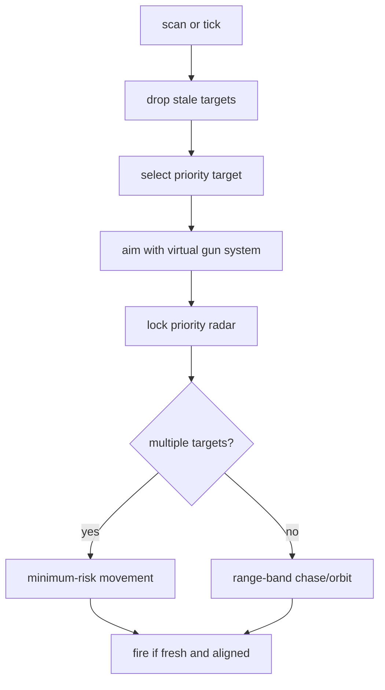
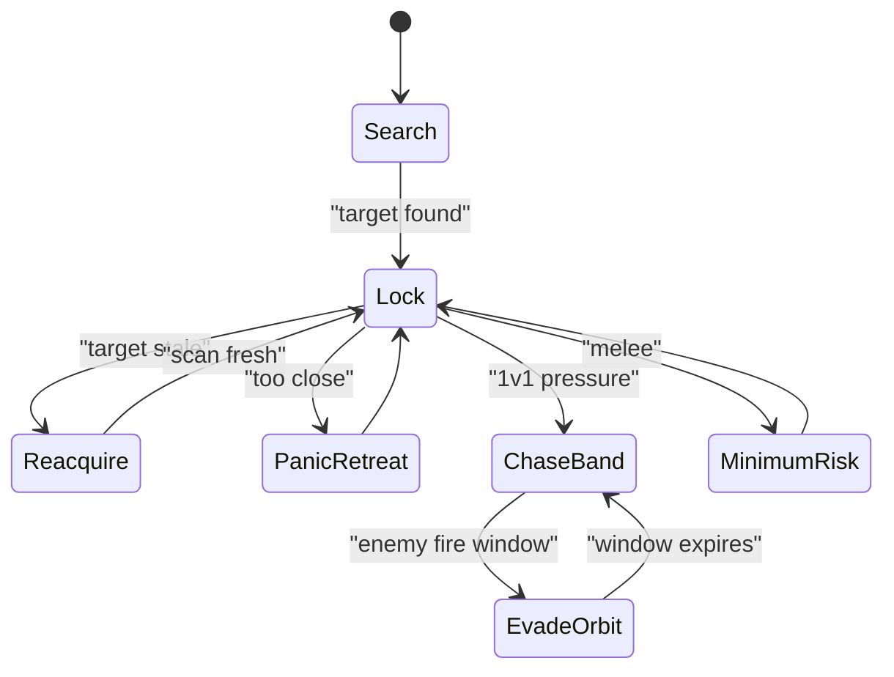

# Chase Lock

Chase Lock is the pressure bot. It tries to keep radar and gun locked on one
priority target while moving enough to avoid becoming stationary. It shares the
common virtual gun, wave, enemy-fire, and telemetry systems, but its local logic
is intentionally simpler and more chase-oriented than Adaptive Prime.

Shared systems are documented in:

- [Shared Bot Systems](../../docs/bot-shared-systems.md)
- [Bot Core Data Structures](../../docs/bot-core-data-structures.md)

## What Makes It Different

- Strong current-target preference.
- Direct range-band movement instead of potential-field routing.
- Uses flattener direction changes, but not go-to surfing as the primary route.
- In melee, falls back to minimum-risk movement to reduce target tunneling.
- Firepower is more conservative than Adaptive Prime.

## Turn Flow



## Movement State



## Target Scoring

Lower score wins:

```text
score = distance * 0.45 + target_energy * 2.0 + age * 80 - bonuses
```

Bonuses favor the current target and recent fire threat. This makes Chase Lock
feel persistent, but stale targets are still dropped or reacquired.

## Movement Bands

```text
target weak and not too close -> finish_close
distance < CLOSE_RESET_DISTANCE -> reset_range
distance < PREFERRED_MIN_DISTANCE -> open_range
distance > PREFERRED_MAX_DISTANCE -> approach_orbit
enemy fire active -> evade_orbit
otherwise -> mid_orbit
```

Movement command:

```text
turn = body_bearing_to_target + strafe_offset * evade_direction
target_speed = mode_speed
```

The shared flattener may flip `evade_direction` when current lateral movement
has become too dangerous.

## Firepower Policy

```text
low own energy:
  p = 0.8 close, else 0.6
finisher:
  p = clamp(target_energy / 3.5 + 0.2, 0.6, 2.2)
distance < 160:
  p = 2.2 if own energy > 36 else 1.6
distance < 280:
  p = 1.8 only with enough visits/confidence
distance < 420:
  p = 1.6 only with stronger visits/confidence
mid/far:
  p = 1.1 or 0.8
```

## Gun Policy

Chase Lock keeps bot-specific `GunPolicy`, fire, target, radar, and movement
surfaces in `chase_config.py`. Its live gun policy follows the shared
experimental selector shape: `dynamic_cluster` is the primary learning gun,
`traditional_gf` is a situational profile gun, and `linear` is an early/simple
movement fallback. It live-selects `linear`, `traditional_gf`, and
`dynamic_cluster` in 1v1. Melee keeps segmented gun stats and live
`traditional_gf` bearings disabled, so `traditional_gf` candidates can appear
as unavailable in switch diagnostics.
`displacement` is available only for forced experiments:

```sh
ROBOCODE_CHASE_GUN_MODE=displacement scripts/run-battle.sh --rounds 8 bots/chase-lock bots/sweep-pressure
```

The retained policy uses aligned aggressive KNN and Traditional GF gates with
the shared trait-based selector priors. Primary KNN can leave fallback linear
early, situational profile guns need a larger margin over KNN unless KNN is in
a low-score slump with trusted source/context evidence, and global-source
situational trials are not retained. `gun.switch_decision` reports raw score,
adjusted score, penalties, and `decision_bonus` for calibration.

For neutral gun-evaluation telemetry, set:

```sh
ROBOCODE_CHASE_GUN_EVAL=1 scripts/run-battle.sh --telemetry --rounds 12 bots/chase-lock bots/circle-strafer
```

Use `ROBOCODE_CHASE_GUN_EVAL_INTERVAL=1` only for denser diagnostic runs where
extra telemetry volume is acceptable.

## Key Telemetry

- `target.select`: target switching evidence.
- `scan.reacquired`: stale cached target refreshed by a new scan.
- `target.drop_lost`: cached target aged out before reacquisition.
- `movement.flatten`: learned lateral direction flips.
- `movement.minimum_risk`: melee fallback destination. In `track` events this
  branch appears as movement mode `melee_minimum_risk`.
- `gun.switch_decision`: sampled virtual-gun candidate scores and rejection
  reasons.
- `gun.eval_wave_visit`: optional neutral gun-evaluation result when
  `ROBOCODE_CHASE_GUN_EVAL=1`.
- `track`: current target, aim mode, movement mode, radar mode, fire hold
  reason.

Use [Tooling: Telemetry Viewer](../../docs/tooling.md#telemetry-viewer) for
launch, reset, audit, and stop commands.

## Tuning Checklist

- Stuck on old target position: inspect `scan.reacquired`,
  `target.drop_lost`, `radar_mode`.
- Too easy to hit while chasing: inspect `enemy.fire_detected`,
  `movement.flatten`, `movement_mode`.
- Weak compared with others: inspect range-band modes and firepower confidence
  gates.
- Bad melee behavior: inspect `movement.minimum_risk` frequency and target
  switches.
