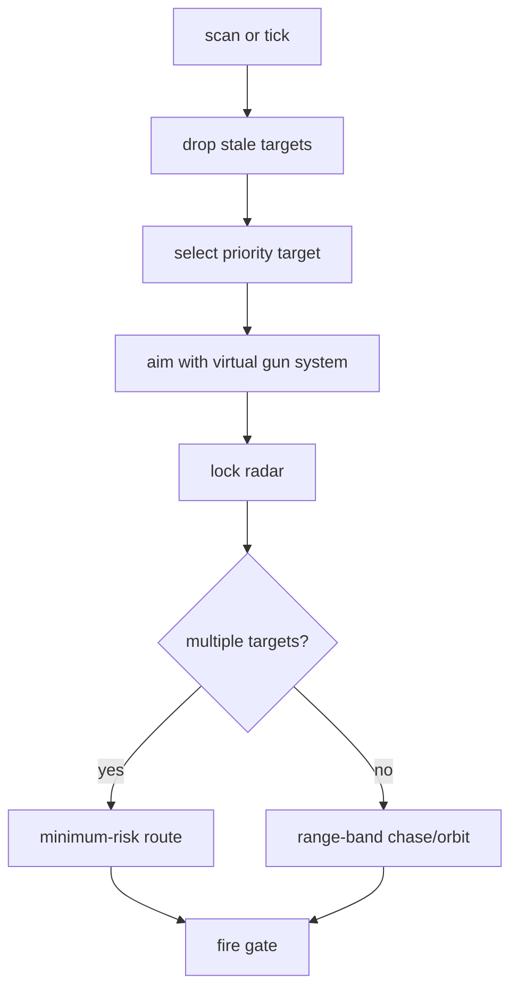

# Chase Lock

Chase Lock is the pressure bot. It keeps radar and gun focus on one priority
target while moving enough to avoid becoming stationary.

Shared references:

- [Shared Bot Systems](../../docs/bot-shared-systems.md)
- [Bot Core Data Structures](../../docs/bot-core-data-structures.md)
- [Tooling](../../docs/tooling.md)

Bot-specific policy lives in `chase_config.py`.

## Behavior



What makes Chase different:

- Strong current-target preference.
- Direct range-band chase/orbit movement.
- Flattener direction changes, but no primary go-to surfing route.
- Minimum-risk movement in melee.
- More conservative firepower than Adaptive Prime.

## Target And Movement Policy

Lower target score wins:

```text
score = distance * 0.45 + target_energy * 2.0 + age * 80 - bonuses
```

Bonuses favor the current target and recent fire threats.

Movement bands:

```text
target weak and not too close -> finish_close
distance < close reset -> reset_range
distance < preferred min -> open_range
distance > preferred max -> approach_orbit
enemy fire active -> evade_orbit
otherwise -> mid_orbit
```

Melee uses shared minimum-risk movement.

## Guns And Firepower

Normal selectable guns are `linear`, `dynamic_cluster`, `traditional_gf`, and
`displacement`. KNN is primary; Traditional GF and displacement are situational;
linear is the early/simple-motion fallback.

For isolated gun testing:

```sh
ROBOCODE_CHASE_GUN_MODE=displacement \
scripts/run-battle.sh --rounds 8 bots/chase-lock bots/sweep-pressure
```

Useful knobs:

```sh
ROBOCODE_CHASE_GUN_SET=linear,dynamic_cluster,traditional_gf,displacement
ROBOCODE_CHASE_GUN_EVAL=1
ROBOCODE_CHASE_GUN_EVAL_INTERVAL=1
```

Firepower is close-range pressure with confidence gates in the mid bands:

```text
last stand: up to 0.6 while leaving a small reserve
low energy: 0.6-0.8
finisher: target_energy / 3.5 + 0.2, clamped
close: 1.6-2.2
mid: 1.1-1.8 depending on confidence/visits
far: 0.8
```

## Analysis

Key telemetry:

- `target.select`
- `scan.reacquired`
- `target.drop_lost`
- `movement.flatten`
- `movement.minimum_risk`
- `gun.switch_decision`
- `gun.eval_wave_visit`
- `track`
- `bot.turn_timing` / `bot.skipped_turn`

Useful checks:

```sh
scripts/run-battle.sh --telemetry --rounds 12 bots/chase-lock bots/circle-strafer
tools/telemetry_audit.py battle-results/runs/<run>/telemetry --require-bot chase-lock
tools/gun_eval_summary.py battle-results/runs/<run>/telemetry --bot chase-lock
```
