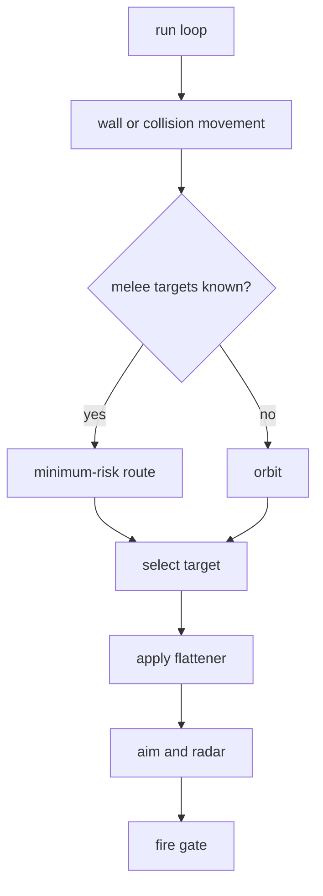

# Circle Strafer

Circle Strafer is the stable orbital bot. It keeps lateral motion around the
selected target, prioritizes separation from close enemies, and escapes walls
before doing anything clever.

Shared references:

- [Shared Bot Systems](../../docs/bot-shared-systems.md)
- [Bot Core Data Structures](../../docs/bot-core-data-structures.md)
- [Tooling](../../docs/tooling.md)

Bot-specific policy lives in `circle_config.py`.

## Behavior



What makes Circle different:

- Constant lateral orbit is the default.
- Close-enemy separation has higher priority than aiming pressure.
- Wall escape is conservative and held until clearly safe.
- 1v1 learning changes orbit direction rather than route selection.
- Melee uses minimum-risk movement when enough targets are known.

## Target And Movement Policy

Lower target score wins:

```text
score = distance * 0.5 + target_energy * 1.7 + target_age * 85 - current_target_bonus
```

Movement priority:

1. Wall escape.
2. Close-enemy or collision separation.
3. Melee minimum-risk movement.
4. Normal orbit.
5. 1v1 flattener direction flip.

Enemy-fire feints can briefly tighten or widen the orbit, but are disabled near
walls, during close separation, and while on cooldown.

## Guns And Firepower

Normal selectable guns are `linear`, `dynamic_cluster`, `traditional_gf`, and
`displacement`. KNN is primary; Traditional GF and displacement are situational;
linear is the early/simple-motion fallback.

For isolated gun testing:

```sh
ROBOCODE_CIRCLE_GUN_MODE=displacement \
scripts/run-battle.sh --rounds 8 bots/circle-strafer bots/sweep-pressure
```

Useful knobs:

```sh
ROBOCODE_CIRCLE_GUN_SET=linear,dynamic_cluster,traditional_gf,displacement
ROBOCODE_CIRCLE_DISPLACEMENT_MARKOV=0
ROBOCODE_CIRCLE_GUN_EVAL=1
ROBOCODE_CIRCLE_GUN_EVAL_INTERVAL=1
```

Firepower is deliberately restrained:

```text
last stand: up to 0.6 while leaving a small reserve
low energy: 0.6-0.8
close: 1.8
mid: 1.0
far: 0.8
```

## Analysis

Key telemetry:

- `wall.avoid`
- `separate`
- `movement.feint`
- `movement.minimum_risk`
- `movement.flatten`
- `gun.switch_decision`
- `gun.eval_wave_visit`
- `track`
- `bot.turn_timing` / `bot.skipped_turn`

Useful checks:

```sh
scripts/run-battle.sh --telemetry --rounds 12 bots/circle-strafer bots/sweep-pressure
tools/telemetry_audit.py battle-results/runs/<run>/telemetry --require-bot circle-strafer
tools/gun_eval_summary.py battle-results/runs/<run>/telemetry --bot circle-strafer
```
