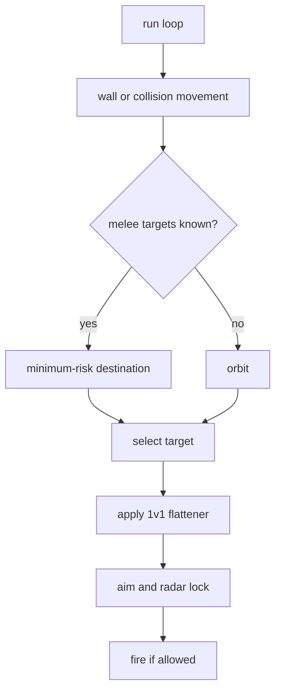
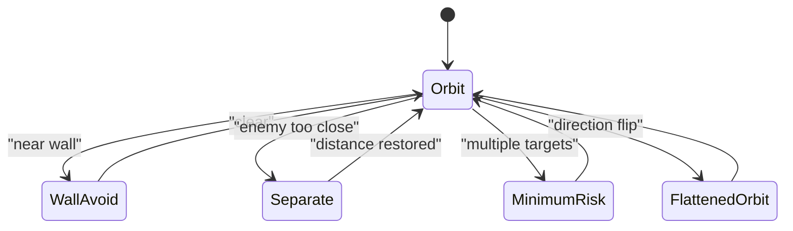

# Circle Strafer

Circle Strafer is the stable orbital bot. It keeps lateral motion around the
selected target, separates from close enemies, and avoids walls before doing
anything clever. It uses the shared virtual gun and movement learning systems,
but its own behavior is deliberately predictable and defensive.

Shared systems are documented in:

- [Shared Bot Systems](../../docs/bot-shared-systems.md)
- [Bot Core Data Structures](../../docs/bot-core-data-structures.md)

## What Makes It Different

- Constant lateral orbit is the default behavior.
- Close enemy separation has higher priority than aiming pressure.
- Wall escape is simple and conservative.
- 1v1 movement learning only changes orbit direction.
- Melee uses minimum-risk movement when enough targets are known.

## Turn Flow



## Movement State



## Target Scoring

Lower score wins:

```text
score = distance * 0.5 + target_energy * 1.7 + target_age * 85 - current_target_bonus
```

Circle keeps its current target unless another target is clearly better or the
current target becomes stale.

## Movement Rules

Priority order:

1. Wall escape: turn toward arena center.
2. Separation: move away from close enemy or recent collision.
3. Melee minimum-risk destination.
4. Normal orbit.
5. 1v1 flattener direction flip.

Separation uses a mirrored point away from the close enemy plus a lateral offset.
This keeps the bot from ramming while preserving lateral motion.

## Firepower Policy

```text
own energy <= LOW_ENERGY_HOLD:
  p = 0.8 if distance < 180 else 0.6
distance < 170:
  p = 1.8
distance < 420:
  p = 1.0
otherwise:
  p = 0.8
```

Circle holds fire when scans are stale, energy is critical, the target is too
far while energy is low, or gun bearing error is too large.

## Gun Policy

Circle Strafer keeps bot-specific `GunPolicy`, fire, target, radar, and
movement surfaces in `circle_config.py`. Its defensive gun policy uses
shared-default switch thresholds plus a shorter base visit gate for
`dynamic_cluster` warmup. It live-selects `linear`, `traditional_gf`, and
`dynamic_cluster` in 1v1. Melee keeps segmented gun stats and live
`traditional_gf` bearings disabled, so `traditional_gf` candidates can appear
as unavailable in switch diagnostics.
The current policy lowers the base visit gate while keeping traditional GF's
separate conservative override. `displacement` is available only for forced
experiments:

```sh
ROBOCODE_CIRCLE_GUN_MODE=displacement scripts/run-battle.sh --rounds 8 bots/circle-strafer bots/sweep-pressure
```

For neutral gun-evaluation telemetry, set:

```sh
ROBOCODE_CIRCLE_GUN_EVAL=1 scripts/run-battle.sh --telemetry --rounds 12 bots/circle-strafer bots/sweep-pressure
```

Use `ROBOCODE_CIRCLE_GUN_EVAL_INTERVAL=1` only for denser diagnostic runs where
extra telemetry volume is acceptable.

## Key Telemetry

- `wall.avoid`: wall escape.
- `separate`: close enemy or collision escape.
- `movement.minimum_risk`: melee destination.
- `movement.flatten`: orbit direction changes.
- `gun.switch_decision`: sampled virtual-gun candidate scores and rejection
  reasons.
- `gun.eval_wave_visit`: optional neutral gun-evaluation result when
  `ROBOCODE_CIRCLE_GUN_EVAL=1`.
- `track`: target, radar, aim mode, fire hold reason.

Use [Tooling: Telemetry Viewer](../../docs/tooling.md#telemetry-viewer) for
launch, reset, audit, and stop commands.

## Tuning Checklist

- Wall clipping: inspect `wall.avoid`, `WALL_MARGIN`, `WALL_ESCAPE_TURNS`.
- Close combat losses: inspect `separate`, `SEPARATION_DISTANCE`,
  `PANIC_DISTANCE`.
- Predictable orbit: inspect `movement.flatten` and `movement.profile_visit`.
- Low damage: inspect `hold_reason`, `firepower`, and `aim_mode`.
