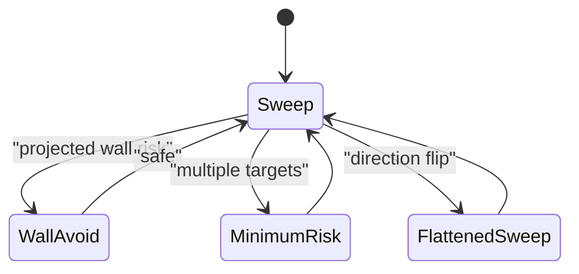

# Sweep Pressure

Sweep Pressure is the direct pressure bot. It keeps moving with a sweeping turn
pattern, avoids projected wall collisions, and applies steady fire. Compared
with Circle Strafer, it is less collision-focused and more willing to pressure
range.

Shared systems are documented in:

- [Shared Bot Systems](../../docs/bot-shared-systems.md)
- [Bot Core Data Structures](../../docs/bot-core-data-structures.md)

## What Makes It Different

- Sweep movement is the default.
- Wall risk is projected ahead using heading, speed, and lookahead ticks.
- 1v1 flattener flips sweep direction when learned danger says to.
- Melee uses minimum-risk destinations instead of plain sweeping.
- Close-range firepower is slightly more aggressive than Circle.

## Turn Flow


## Movement State



## Sweep Movement

Base command:

```text
target_speed = SWEEP_SPEED * move_direction
turn_rate = SWEEP_TURN_RATE
```

During an evasion window:

```text
turn_rate = -SWEEP_TURN_RATE * move_direction
```

Wall projection:

```text
projected_x = x + cos(direction) * SWEEP_SPEED * move_direction * WALL_LOOKAHEAD_TICKS
projected_y = y + sin(direction) * SWEEP_SPEED * move_direction * WALL_LOOKAHEAD_TICKS
```

If the projected point violates `WALL_MARGIN`, the bot turns toward the arena
center.

## Target Scoring

Lower score wins:

```text
score = distance * 0.45 + target_energy * 2.0 + target_age * 80 - current_target_bonus
```

## Firepower Policy

```text
own energy <= LOW_ENERGY_HOLD:
  p = 0.8 if distance < 220 else 0.6
distance < 180:
  p = 2.0
distance < 360:
  p = 1.2
otherwise:
  p = 0.8
```

Sweep holds fire when the target is stale, energy is critical, low energy meets
long range, gun bearing error is too high, or energy margin is too small.

## Gun Policy

Sweep Pressure uses a bot-specific `GunPolicy` surface with shared-default
switch thresholds. It live-selects `linear`, `traditional_gf`, and
`dynamic_cluster`. Short A/B tuning rejected looser thresholds, so the current
policy keeps shared switch gates while exposing switch-decision telemetry.
`displacement` is available only for forced experiments:

```sh
ROBOCODE_SWEEP_GUN_MODE=displacement scripts/run-battle.sh --rounds 8 bots/sweep-pressure bots/circle-strafer
```

For neutral gun-evaluation telemetry, set:

```sh
ROBOCODE_SWEEP_GUN_EVAL=1 scripts/run-battle.sh --telemetry --rounds 12 bots/sweep-pressure bots/circle-strafer
```

Use `ROBOCODE_SWEEP_GUN_EVAL_INTERVAL=1` only for denser diagnostic runs where
extra telemetry volume is acceptable.

## Key Telemetry

- `wall.avoid`: projected wall risk response.
- `movement.minimum_risk`: melee destination.
- `movement.flatten`: sweep direction change.
- `track`: target, radar, aim mode, fire hold reason.
- `gun.switch`: selected virtual gun mode changes.
- `gun.switch_decision`: sampled virtual-gun candidate scores and rejection
  reasons.
- `gun.eval_wave_visit`: optional neutral gun-evaluation result when
  `ROBOCODE_SWEEP_GUN_EVAL=1`.

Use [Tooling: Telemetry Viewer](../../docs/tooling.md#telemetry-viewer) for
launch, reset, audit, and stop commands.

## Tuning Checklist

- Wall hits: inspect `wall.avoid`, `WALL_MARGIN`, `WALL_LOOKAHEAD_TICKS`.
- Predictable sweep: inspect `movement.flatten` and `move_direction`.
- Bad melee survival: inspect `movement.minimum_risk`.
- Wasted energy: inspect `firepower`, `hold_reason`, and hit rate by
  `aim_mode`.
