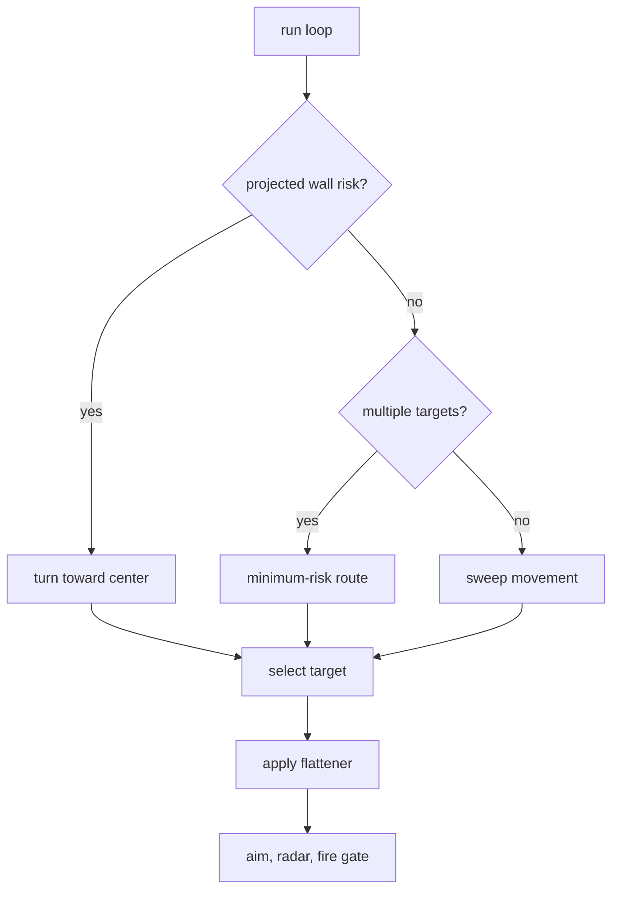

# Sweep Pressure

Sweep Pressure is the direct pressure bot. It keeps moving with a sweeping turn
pattern, avoids projected wall collisions, and applies steady fire.

Shared references:

- [Shared Bot Systems](../../docs/bot-shared-systems.md)
- [Bot Core Data Structures](../../docs/bot-core-data-structures.md)
- [Tooling](../../docs/tooling.md)

Bot-specific policy lives in `sweep_config.py`.

## Behavior



What makes Sweep different:

- Sweep movement is the default.
- Wall risk uses current and projected position.
- Enemy-fire feints use a short counter-sweep instead of a permanent direction
  flip.
- 1v1 learning can flip sweep direction.
- Melee uses minimum-risk movement instead of plain sweeping.

## Target And Movement Policy

Lower target score wins:

```text
score = distance * 0.45 + target_energy * 2.0 + target_age * 80 - current_target_bonus
```

Base sweep:

```text
target_speed = SWEEP_SPEED * move_direction
turn_rate = SWEEP_TURN_RATE
```

During an evasion window:

```text
turn_rate = -SWEEP_TURN_RATE * move_direction
```

Wall projection checks the future point from current heading, speed,
`move_direction`, and lookahead ticks. Wall escape stays active until both
current and projected positions clear the margin.

## Guns And Firepower

Normal selectable guns are `linear`, `dynamic_cluster`, `traditional_gf`, and
`displacement`. KNN is primary; Traditional GF and displacement are situational;
linear is the early/simple-motion fallback.

For isolated gun testing:

```sh
ROBOCODE_SWEEP_GUN_MODE=displacement \
scripts/run-battle.sh --rounds 8 bots/sweep-pressure bots/circle-strafer
```

Useful knobs:

```sh
ROBOCODE_SWEEP_GUN_SET=linear,dynamic_cluster,traditional_gf,displacement
ROBOCODE_SWEEP_DISPLACEMENT_MARKOV=0
ROBOCODE_SWEEP_GUN_EVAL=1
ROBOCODE_SWEEP_GUN_EVAL_INTERVAL=1
```

Firepower is slightly more aggressive than Circle at close range:

```text
last stand: up to 0.6 while leaving a small reserve
low energy: 0.6-0.8
close: 2.0
mid: 1.2
far: 0.8
```

## Analysis

Key telemetry:

- `wall.avoid`
- `movement.feint`
- `movement.minimum_risk`
- `movement.flatten`
- `gun.switch`
- `gun.switch_decision`
- `gun.eval_wave_visit`
- `track`
- `bot.turn_timing` / `bot.skipped_turn`

Useful checks:

```sh
scripts/run-battle.sh --telemetry --rounds 12 bots/sweep-pressure bots/circle-strafer
tools/telemetry_audit.py battle-results/runs/<run>/telemetry --require-bot sweep-pressure
tools/gun_eval_summary.py battle-results/runs/<run>/telemetry --bot sweep-pressure
```
