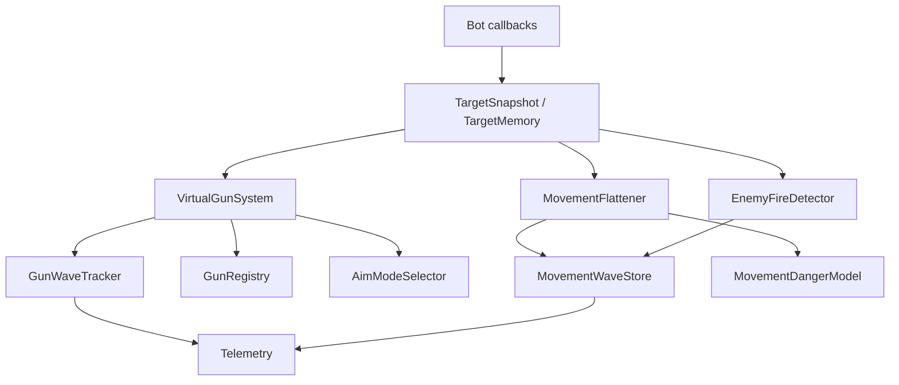

# Bot Core Data Structures

This is the compact implementation map for shared structures in `bots/bot_core`.
Behavior-level notes live in [Shared Bot Systems](bot-shared-systems.md), and
the generated telemetry contract lives in [Telemetry Event Schema](telemetry-schema.md).

## System Map



## Target Data

| Structure | Module | Purpose |
| --- | --- | --- |
| `TargetSnapshot` | `bot_core.target_snapshot` | Canonical scan cache: id, energy, location, direction, speed, seen turn. |
| `TargetMemory` | `bot_core.targeting` | Stale/fresh target queries and active fire-threat lookup. |
| `TargetSelector` | `bot_core.targeting` | Reacquire-age filtering plus bot-specific score callback. |
| `TargetHistoryStore` | `bot_core.gun.context` | Bounded per-target movement history for context tags and history-backed guns. |
| `TargetPosition` | `bot_core.gun.models` | Historical target state plus observed lateral/advancing speed, wall margin, and distance. |
| `OwnMotionTracker` | `bot_core.motion` | Recent acceleration, direction-change age, and decel age for movement-wave features. |

Important invariant:

```text
target_age = current_turn - seen_turn
```

## Gun Data

| Structure | Purpose |
| --- | --- |
| `GunRuntimeConfig` | Bot wiring boundary for system, selector, scoring, and component factories. |
| `FireContext` | Fire-time tactical context: movement tags, flight time, lateral direction/confidence, wall margin, escape balance, distance/firepower buckets. |
| `AimContext` | Shared input passed to concrete guns. |
| `GunBearing` | Concrete gun candidate bearing plus optional GF/context/metadata. |
| `AimSolution` | Selected aim result returned to bots. |
| `GunWave` | Fired or eval bullet wave used to score virtual guns. |
| `WaveVisit` / `GunVisit` | Resolved wave result for telemetry, scoring, and component learning. |
| `GunStats` | Per-target/per-mode visits, hits, and rolling score. |
| `GunModeTraits` | Generic selector labels for role/family/phase/context strengths. |
| `GunSwitchCandidate` | Selector diagnostic record with raw/adjusted score, penalties, bonuses, visits, thresholds, and reason. |
| `GunRegistry` | Holds concrete gun components. |
| `VirtualGunSystem` | Bot-facing facade for context, bearings, waves, scoring, selection, and telemetry data. |
| `GunWaveTracker` | Pending/fired wave retention and cleanup. |
| `VirtualGunScorer` | Virtual-bearing score updates. |
| `AimModeSelector` | Sticky mode selection gates. |
| `RollingKnnBuffer` | Dynamic Cluster sample memory. |
| `GuessFactorProfile` | Profile-gun histogram. Traditional GF and anti-surfer own package-local profile variants. |

Concrete gun packages:

| Package | State |
| --- | --- |
| [`head_on`](../bots/bot_core/gun/guns/head_on/README.md) | Stateless direct bearing. |
| [`linear`](../bots/bot_core/gun/guns/linear/README.md) | Stateless intercept and wall-aware diagnostics. |
| [`displacement`](../bots/bot_core/gun/guns/displacement/README.md) | Reads `TargetHistoryStore`, ranks similar replay candidates, chooses density-supported replay cluster. |
| [`dynamic_cluster`](../bots/bot_core/gun/guns/dynamic_cluster/README.md) | Owns KNN memory, neighbor weighting, bandwidth/peak diagnostics, and sample insertion. |
| [`traditional_gf`](../bots/bot_core/gun/guns/traditional_gf/README.md) | Owns global and fixed flight/lateral/wall-margin GF profiles, source-aware selector context, and diagnostics. |
| [`anti_surfer`](../bots/bot_core/gun/guns/anti_surfer/README.md) | Owns anti-surfer profile bins and valley selection. |

## Gun Wave Flow

```text
aim target
create pending GunWave
fire bullet
promote pending wave to fired wave
update waves until target intercept
score all virtual bearings
update production stats and component learners
emit WaveVisit telemetry
```

Eval waves follow the same scoring path but stay out of production stats and
component learners unless selector policy explicitly uses eval evidence as a
read-only bonus.

Guess-factor basics:

```text
bearing_offset = actual_bearing - fire_bearing
guess_factor = bearing_offset / wall_limited_escape_angle
bullet_speed = 20 - 3 * firepower
gun_heat = 1 + firepower / 5
```

Geometry helpers live in `bot_core.geometry`; bullet physics lives in
`bot_core.physics`.

## Movement Data

| Structure | Purpose |
| --- | --- |
| `MovementWave` | Enemy bullet wave used for surf/danger learning. |
| `MovementWaveStore` | Active movement waves and cleanup. |
| `MovementProfile` | Per-enemy movement GF bins. |
| `MovementStatsBufferSet` | Segmented movement danger ensemble. |
| `MovementDangerModel` | Combines profile, ensemble, unvisited-bin, wall, and travel danger. |
| `MovementFlattener` | Shared facade used by bots. |
| `SurfingPlanner` | Go-to surf candidate generation and scoring. |
| `MovementCommand` | Testable movement output abstraction. |
| `ShadowBullet` | Bullet-shadow approximation based on actual fired bullet state. |

Movement-wave features include distance, lateral speed, acceleration, wall
margin, bullet power, and recent direction-change/decel age. The predictor uses
Tank Royale target-speed order: speed update, move along previous direction,
turn limit, wall clip, and zero speed after wall hit.

## Energy And Enemy Fire

| Structure | Purpose |
| --- | --- |
| `EnergyDropConfig` | Shared thresholds for fire/noise classification. |
| `EnemyEnergyCorrectionLedger` | Tracks correction for known non-fire energy changes. |
| `EnemyFireDetector` | Shared sequence for corrected drop classification, gun heat, fire-power samples, and telemetry. |
| `EnemyFirePowerPredictor` | KNN-style enemy bullet-power prediction. |
| `GunHeatTracker` | Expected enemy fire readiness. |
| `FireDecision` | Shared fire-gate result and hold reason. |

Accepted enemy fire normally satisfies:

```text
0.1 <= corrected_drop <= 3.0
scan_gap <= policy limit
not collision/noise
```

## Telemetry Records

JSONL envelope:

```text
{
  "bot": "...",
  "event": "...",
  "turn": 123,
  "state": {...},
  "fields": {...}
}
```

Common field meanings should stay stable across bots: `target`, `distance`,
`power`, `damage`, `bullet_id`, `aim_mode`, `gun_mode`, `movement_mode`,
`mode`, `evasion`, `evading`, `wall_risk`, and `reason`.

Use:

- `tools/telemetry_audit.py` for schema and attribution checks.
- `tools/combat_economics_summary.py` for score, firepower, damage, and
  per-gun real conversion.
- `tools/gun_eval_summary.py` for virtual-gun calibration and selector
  diagnostics.

## Extension Rules

- Put shared behavior and data structures in `bots/bot_core`.
- Keep bot personality in bot-local config/README files.
- Add exact formulas here only when multiple systems use them.
- Put workflow commands in [Tooling](tooling.md), not in every bot README.
- Add concrete gun details to the relevant gun package README.
