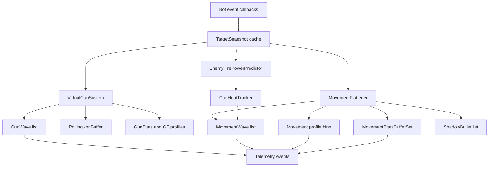
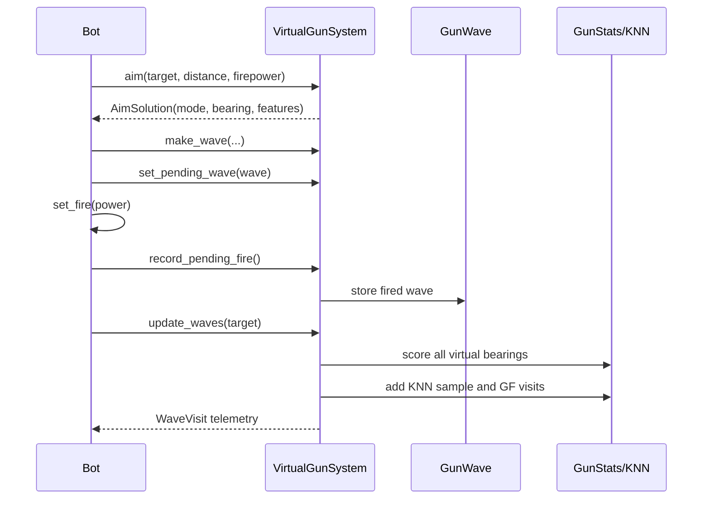
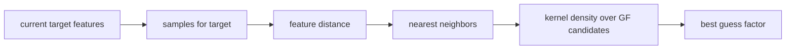

# Bot Core Data Structures

This document describes shared structures used by the bots in `bots/bot_core`.
It is the place for implementation-level concepts that are reused across bots:
target snapshots, virtual guns, waves, KNN buffers, rolling statistics,
movement danger buffers, enemy fire prediction, and telemetry records.

The implementation is intentionally experimental. These structures are tuned for
fast iteration and readable telemetry rather than maximum theoretical accuracy.

## System Map



## Core Snapshots

### `TargetSnapshot`

Location: `bot_core.tank_math`

```text
TargetSnapshot(
  bot_id,
  energy,
  x,
  y,
  direction,
  speed,
  seen_turn
)
```

This is the canonical per-enemy scan cache. Bots keep a dictionary keyed by
`bot_id`. Almost every targeting, radar, movement, and fire-power decision reads
from this structure.

Important derived value:

```text
target_age = current_turn - seen_turn
```

Bots use target age to decide if a target is still safe to fire at, whether
radar should reacquire, and when stale targets should be dropped.

### Own Motion Snapshots

Location: `bot_core.motion`

`OwnMotionTracker` records recent acceleration, direction-change age, and decel
age for the bot itself. These values become movement-wave features, so movement
danger learning can distinguish "I was accelerating near a wall" from "I was
moving laterally in open field."

## Virtual Gun Data

Location: `bot_core.gun`

### Main Structures

| Structure | Purpose |
| --- | --- |
| `GunConfig` | Tuning constants for KNN, wave scoring, switch thresholds, and profiles. |
| `GunSample` | One learned target escape sample for KNN: target id, turn, feature vector, guess factor. |
| `GunWave` | A simulated bullet wave for a fired shot. Used to score virtual guns when it reaches the target. |
| `GunStats` | Per-target/per-mode visits, hits, and rolling score. |
| `GuessFactorProfile` | Decayed histogram for traditional and anti-surfer guess-factor aiming. |
| `AimSolution` | Output of aiming: predicted point, bearing error, selected mode, features, and mode-change info. |
| `WaveVisit` | Telemetry/learning result when a gun wave reaches the target. |
| `RollingKnnBuffer` | Per-target bounded memory of `GunSample` records. |
| `VirtualGunSystem` | The orchestrator for aiming, scoring, KNN memory, waves, and virtual gun selection. |

### Gun Wave Lifecycle



### Guess Factor Math

A gun wave records the bearing at fire time and the target lateral direction.
When the wave reaches the target:

```text
bearing_offset = actual_bearing - fire_bearing
guess_factor = bearing_offset / max_escape_angle
```

The code uses wall-limited positive and negative escape angles, not only the
theoretical maximum, so the denominator depends on which side of the firing
bearing the target escaped toward.

Bullet physics:

```text
bullet_speed = 20 - 3 * firepower
max_escape_angle = asin(8 / bullet_speed)
gun_heat = 1 + firepower / 5
```

### Virtual Gun Scoring

Every fired wave stores all virtual bearings available at fire time. When the
wave reaches the target, each virtual gun receives a score based on angular
error:

```text
hit_angle = atan2(18, target_distance)
score = max(0, 1 - abs(virtual_bearing - actual_bearing) / hit_angle)
```

`GunStats.rolling_score` is updated with an exponential rolling average:

```text
rolling_score = (1 - alpha) * rolling_score + alpha * score
```

The final raw gun score blends rolling score and hit rate:

```text
raw_score = 0.7 * rolling_score + 0.3 * (hits / visits)
```

Segmented stats can blend global score with segment score when enough segment
visits exist:

```text
score = global_score * (1 - blend) + segment_score * blend
```

### KNN Gun Memory

`RollingKnnBuffer` stores `GunSample` values per target.

Memory limits:

```text
max_samples = 1200
max_samples_per_target = 900
```

The buffer trims oldest samples per target first, then trims globally by oldest
turn if the total count is too high.

KNN query flow:



Feature distance is normalized Euclidean distance over the feature tuple:

```text
distance = sqrt(sum((left_i - right_i)^2))
```

The selected dynamic-cluster guess factor is the candidate with highest kernel
density:

```text
score(candidate) = sum(weight * exp(-(candidate - sample_guess_factor)^2))
```

Samples can support decay through half-life weighting, but the current
configuration leaves gun KNN decay disabled by default:

```text
decayed_weight = 1.0            when half_life <= 0
decayed_weight = 0.5^(age/half_life) otherwise
```

## Movement Data

Location: `bot_core.movement`

### Main Structures

| Structure | Purpose |
| --- | --- |
| `MovementWave` | Enemy bullet wave, confirmed or expected. |
| `MovementWaveFeatures` | Lateral velocity, advancing velocity, flight time, acceleration, direction-change age, decel age, wall distance. |
| `MovementProfileVisit` | Recorded visit to a guess-factor bin for movement learning. |
| `MovementStatsBuffer` | Segmented danger histogram for a specific feature set. |
| `MovementStatsBufferSet` | Ensemble of multiple segmented buffers. |
| `FlatteningDecision` | Direction-switch decision for orbit/strafe movement. |
| `GoToSurfDecision` | Scored destination for go-to surfing. |
| `ShadowBullet` | Our bullet used to lower danger where it intersects an enemy wave. |
| `MinimumRiskDecision` | Destination selected for melee minimum-risk movement. |

### Movement Wave

`MovementWave` represents an enemy bullet:

```text
target_id
source_x, source_y
direct_bearing
lateral_direction
bullet_speed
max_escape_angle_positive
max_escape_angle_negative
fired_turn
distance_bucket
kind = confirmed | expected
expected_confidence
features
```

Confirmed waves come from energy drops. Expected waves come from enemy gun heat
prediction.

### Movement Profile Bins

The basic movement profile is keyed by:

```text
(target_id, distance_bucket, guess_factor_bin)
```

Distance buckets:

```text
near: distance < 280
mid:  distance < 480
far:  otherwise
```

Bin count is 31. Nearby bins are smoothed:

```text
smoothed_count = bin[0] * 1.0
               + bin[-1] * 0.55 + bin[1] * 0.55
               + bin[-2] * 0.25 + bin[2] * 0.25
```

The profile decays when a target accumulates too many visits:

```text
if total_target_visits > profile_decay_after:
  every target profile bin *= 0.5
```

### Stats Buffer Ensemble

`MovementStatsBufferSet` contains several segmented buffers:

```text
distance
lateral
advancing
accel
wall
flight
distance_lateral
distance_wall
distance_flight
lateral_accel
lateral_wall
distance_decel
```

Each buffer maps:

```text
(target_id, segment_tuple, bin_index) -> decayed visit count
```

Each segment also stores an effective sample count:

```text
(target_id, segment_tuple) -> samples
```

On every write, the touched segment decays:

```text
visit *= stats_buffer_decay
drop visit if visit < 0.001
```

The ensemble danger is a confidence-weighted average across buffers:

```text
confidence = clamp(samples / stats_buffer_min_samples, 0, 1)
ensemble_danger = sum(buffer_danger * confidence) / sum(confidence)
```

The final learned danger is conservative. The ensemble can raise danger above
the base profile, but does not reduce it below the profile:

```text
ensemble_weight = stats_buffer_weight * clamp(ensemble_samples / stats_buffer_max_effective_samples, 0, 1)
learned_danger = profile_danger + max(0, ensemble_danger - profile_danger) * ensemble_weight
total_danger = learned_danger + unvisited_bin_danger
```

### Flattener Direction Selection

The flattener compares danger for current lateral direction and the opposite
direction. If the alternative is safer by the switch margin and cooldown allows
it, the bot flips direction.

```text
if alternative_count + switch_margin < current_count:
  switch direction
else:
  keep direction
```

With surfing enabled, it projects a future position until the wave intercepts.
Without surfing, it projects a simpler fixed lookahead point.

### Go-To Surfing

Go-to surfing generates candidate destinations around the current position and
simulates driving to each destination until the selected wave intersects.

Candidate score:

```text
danger = learned_danger + wall_risk + distance_risk + travel_risk
```

Where:

```text
wall_risk = goto_wall_weight / distance_from_wall
distance_risk = penalty for too close, too far, or away from preferred range
travel_risk = travel_distance * goto_travel_weight
```

The lowest danger candidate becomes a `GoToSurfDecision`.

### Bullet Shadow Approximation

`ShadowBullet` records our bullet path. If our bullet intersects a confirmed
enemy wave near a guess-factor bin, that bin danger is reduced:

```text
danger *= bullet_shadow_danger_multiplier
```

Expected waves do not use bullet shadows, because there is no confirmed enemy
bullet path to shadow.

### Minimum Risk Movement

Minimum-risk movement is used mainly in melee.

It creates candidate points around the bot and scores them by:

```text
risk = enemy_proximity
     + close_enemy_penalty
     + focus_target_distance_penalty
     + wall_risk
     + travel_risk
     + recent_destination_penalty
     + optional fire_threat terms
```

The active destination is sticky for a few ticks unless a new destination is
meaningfully lower risk.

## Enemy Fire Prediction

Location: `bot_core.energy`

### Energy Drop Signal

Energy drops are classified as fire with:

```text
raw_drop = previous_energy - current_energy
corrected_drop = previous_energy - (current_energy + energy_correction)
```

The drop is accepted when:

```text
corrected_drop > 0
scan_gap <= max_scan_gap
min_fire_power <= corrected_drop <= max_fire_power
not close_collision_noise
```

If accepted:

```text
fire_power = corrected_drop
bullet_travel_ticks = round(distance / bullet_speed)
evade_ticks = clamp(bullet_travel_ticks + lead, min_evade_ticks, max_evade_ticks)
```

### Enemy Fire-Power KNN

`EnemyFirePowerPredictor` stores per-target samples:

```text
enemy_energy
our_energy
distance
fire_power
```

Features are normalized:

```text
enemy_energy / 100
our_energy / 100
distance / 650
```

Prediction uses nearest neighbors:

```text
weight = 1 / (0.08 + feature_distance)
predicted_power = sum(sample_power * weight) / sum(weight)
```

Before enough samples exist, prediction is blended with a heuristic:

```text
prediction = heuristic * (1 - blend) + knn * blend
confidence <= low_confidence_cap
```

The predictor also tracks mean absolute error when a previous prediction can be
compared to an observed fire power.

### Gun Heat Tracker

`GunHeatTracker` stores one `GunHeatState` per enemy:

```text
heat
last_turn
last_expected_wave_turn
observed_fire
```

Heat cools by:

```text
heat = max(0, heat - cooling_rate * elapsed_turns)
```

Observed fire sets:

```text
heat = 1 + fire_power / 5
```

When heat is ready and enough ticks passed since the last expected wave, the
tracker can create an expected enemy fire wave using predicted firepower.

## Telemetry Records

Location: `bot_core.debug` and `tools/telemetry_viewer`

Telemetry is JSONL. Each record has:

```text
schema
ts
pid
bot
turn
event
state
fields
```

`state` is sampled from the live bot object:

```text
x, y, energy
direction, gun_direction, radar_direction
speed, target_speed
turn_rate, gun_turn_rate, radar_turn_rate
gun_heat, gun_cooling_rate
enemy_count
arena_width, arena_height
```

`fields` are event-specific and should carry decision context: target id,
distance, movement mode, aim mode, radar mode, firepower, gun bearing error,
danger breakdown, wave bin, prediction confidence, and so on.

Important invariant: event fields should make derived dashboard stats possible
without re-running bot logic.

## Approximation Tradeoffs

The current implementation uses practical approximations:

- KNN is linear scan over bounded arrays, not a kd-tree.
- Kernel density is evaluated over candidate guess factors, not a continuous
  solver.
- Movement stats buffers use coarse buckets to keep memory bounded.
- Rolling scores use exponential averages instead of storing all historical
  outcomes.
- Expected gun-heat waves are useful for early evasion, but less certain than
  energy-drop waves.
- Bullet shadowing is conservative and only reduces danger for confirmed waves.

These choices keep the code easy to inspect and telemetry-friendly while still
allowing stronger techniques to be added later.

## When To Extend

Add to this document when introducing:

- a new shared data structure in `bot_core`
- a new KNN feature vector or distance metric
- a new stats buffer, segment, or decay rule
- a new telemetry event schema used by the dashboard
- a new movement/gun approximation that affects bot behavior
