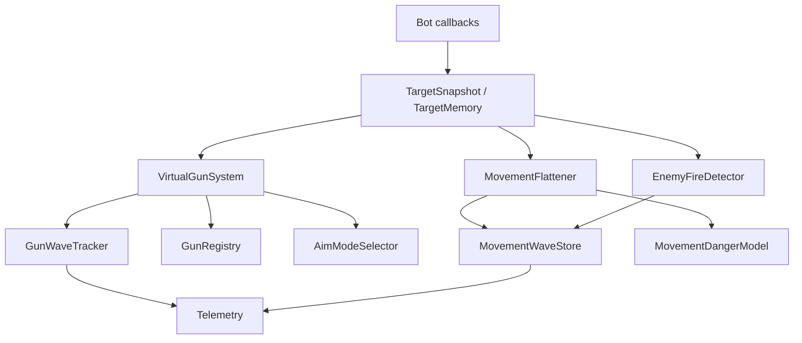

# Bot Core Data Structures

This is the compact implementation map for shared structures in `bots/bot_core`.
Behavior-level notes live in [Shared Bot Systems](bot-shared-systems.md), and
the generated telemetry contract lives in [Telemetry Event Schema](telemetry-schema.md).

## System Map



## Target Data

| Structure | Module | Purpose |
| --- | --- | --- |
| `TargetSnapshot` | `bot_core.target_snapshot` | Canonical scan cache: id, energy, location, direction, speed, seen turn. |
| `TargetMemory` | `bot_core.targeting` | Stale/fresh target queries and active fire-threat lookup. |
| `TargetSelector` | `bot_core.targeting` | Reacquire-age filtering plus bot-specific score callback. |
| `TargetHistoryStore` | `bot_core.gun.context` | Bounded per-target movement history for context tags and history-backed guns. |
| `TargetPosition` | `bot_core.gun.models` | Historical target state plus observed lateral/advancing speed, wall margin, and distance. |
| `OwnMotionTracker` | `bot_core.motion` | Recent acceleration, direction-change age, and decel age for movement-wave features. |

Important invariant:

```text
target_age = current_turn - seen_turn
```

## Gun Data

| Structure | Purpose |
| --- | --- |
| `GunRuntimeConfig` | Bot wiring boundary for system, selector, scoring, and component factories. |
| `FireContext` | Fire-time tactical context: movement tags, flight time, lateral direction/confidence, wall margin, escape balance, distance/firepower buckets. |
| `AimContext` | Shared input passed to concrete guns. |
| `GunBearing` | Concrete gun candidate bearing plus optional GF/context/metadata. |
| `AimSolution` | Selected aim result returned to bots. |
| `GunWave` | Fired or eval bullet wave used to score virtual guns. |
| `WaveVisit` / `GunVisit` | Resolved wave result for telemetry, scoring, and component learning. |
| `GunStats` | Per-target/per-mode visits, hits, and rolling score. |
| `GunModeTraits` | Generic selector labels for role/family/phase/context strengths. |
| `GunSwitchCandidate` | Selector diagnostic record with raw/adjusted score, penalties, bonuses, visits, thresholds, and reason. |
| `GunRegistry` | Holds concrete gun components. |
| `VirtualGunSystem` | Bot-facing facade for context, bearings, waves, scoring, selection, and telemetry data. |
| `GunWaveTracker` | Pending/fired wave retention and cleanup. |
| `VirtualGunScorer` | Virtual-bearing score updates. |
| `AimModeSelector` | Sticky mode selection gates. |
| `RollingKnnBuffer` | Dynamic Cluster sample memory. |
| `GuessFactorProfile` | Profile-gun histogram. Traditional GF and anti-surfer own package-local profile variants. |

Concrete gun packages:

| Package | State |
| --- | --- |
| [`head_on`](../bots/bot_core/gun/guns/head_on/README.md) | Stateless direct bearing. |
| [`linear`](../bots/bot_core/gun/guns/linear/README.md) | Stateless intercept and wall-aware diagnostics. |
| [`displacement`](../bots/bot_core/gun/guns/displacement/README.md) | Reads `TargetHistoryStore`, ranks similar replay candidates, chooses density-supported replay cluster. |
| [`dynamic_cluster`](../bots/bot_core/gun/guns/dynamic_cluster/README.md) | Owns KNN memory, neighbor weighting, bandwidth/peak diagnostics, and sample insertion. |
| [`traditional_gf`](../bots/bot_core/gun/guns/traditional_gf/README.md) | Owns global and fixed flight/lateral/wall-margin GF profiles, source-aware selector context, and diagnostics. |
| [`anti_surfer`](../bots/bot_core/gun/guns/anti_surfer/README.md) | Owns anti-surfer profile bins and valley selection. |

## Gun Wave Flow

```text
aim target
create pending GunWave
fire bullet
promote pending wave to fired wave
update waves until target intercept
score all virtual bearings
update production stats and component learners
emit WaveVisit telemetry
```

Eval waves follow the same scoring path but stay out of production stats and
component learners unless selector policy explicitly uses eval evidence as a
read-only bonus.

Guess-factor basics:

```text
bearing_offset = actual_bearing - fire_bearing
guess_factor = bearing_offset / wall_limited_escape_angle
bullet_speed = 20 - 3 * firepower
gun_heat = 1 + firepower / 5
```

Geometry helpers live in `bot_core.geometry`; bullet physics lives in
`bot_core.physics`.

## Movement Data

| Structure | Purpose |
| --- | --- |
| `MovementWave` | Enemy bullet wave used for surf/danger learning. |
| `MovementWaveStore` | Active movement waves and cleanup. |
| `MovementProfile` | Per-enemy movement GF bins. |
| `MovementStatsBufferSet` | Segmented movement danger ensemble. |
| `MovementDangerModel` | Combines profile, ensemble, unvisited-bin, wall, and travel danger. |
| `MovementFlattener` | Shared facade used by bots. |
| `SurfingPlanner` | Go-to surf candidate generation and scoring. |
| `MovementCommand` | Testable movement output abstraction. |
| `ShadowBullet` | Bullet-shadow approximation based on actual fired bullet state. |

Movement-wave features include distance, lateral speed, acceleration, wall
margin, bullet power, and recent direction-change/decel age. The predictor uses
Tank Royale target-speed order: speed update, move along previous direction,
turn limit, wall clip, and zero speed after wall hit.

## Energy And Enemy Fire

| Structure | Purpose |
| --- | --- |
| `EnergyDropConfig` | Shared thresholds for fire/noise classification. |
| `EnemyEnergyCorrectionLedger` | Tracks correction for known non-fire energy changes. |
| `EnemyFireDetector` | Shared sequence for corrected drop classification, gun heat, fire-power samples, and telemetry. |
| `EnemyFirePowerPredictor` | KNN-style enemy bullet-power prediction. |
| `GunHeatTracker` | Expected enemy fire readiness. |
| `FireDecision` | Shared fire-gate result and hold reason. |

## Combat Economics

| Structure | Purpose |
| --- | --- |
| `CombatProfileStore` | Per-target accepted-shot, resolution, inferred-enemy-fire, and real-enemy-hit ledger, with an unattributed bucket so every engine-accepted bullet is counted. |
| `CombatProfileSnapshot` | Lifetime and common-turn-window totals plus observable pressure tags. |
| `CombatTotals` | Raw economics counters and derived conversion, damage, confidence, and attribution ratios. |
| `OwnBulletResolution` | Accepted own bullet attribution and its final hit, wall, bullet-collision, or round-end outcome. |
| `FireUtilityCalibrator` | Causal hit-probability calibration and accepted-shot lifecycle for shadow utility. |
| `FireUtilityContext` | Gun mode plus compact range, power, and quality/maturity bands. |
| `FireUtilityEstimate` | Calibrated probability, support/fallback, physics values, cooldown, and two utility views. |
| `AcceptedFireUtilityShot` / `FireUtilityOutcome` | Immutable prediction bound to an accepted bullet and its real outcome or correction. |

Movement evidence uses separate `MovementProfile` instances for confirmed-wave
occupancy and matched real hits. The existing composite profile remains the
live compatibility input during the shadow phase. Expected-wave pressure is
computed from active waves and confidence at query time, so it has no permanent
profile store. Hit-profile support is counted within the wave's distance bucket
and maps to `occupancy`, `blended`, or `hit_profile` fallback levels.

Enemy energy-drop detections retain their raw count and also contribute
confidence-weighted shot and fired-energy totals. Confidence starts at `1.0`
for a one-turn scan gap and falls by `0.15` per additional turn, with a `0.55`
floor. This confidence is descriptive only; it does not change live enemy-wave
creation.

The recent combat profile uses one turn interval for every event kind. A
resolution close to the window boundary can therefore appear without its older
fire event; lifetime attribution remains the authoritative accepted-to-resolved
coverage measure.

Round closure remains marked until the next round reset so a same-turn accepted
shot delivered after a win callback is immediately finalized. Because
`BotDeathEvent` runs before `BulletFiredEvent`, target cleanup preserves the
pending gun wave until that lower-priority acceptance callback or round reset.
If attribution is still unavailable, the ledger records the accepted bullet in
an unattributed bucket. A later winning hit can retract that provisional miss.
Offline summaries use every durable accepted-fire and hit event as the terminal
authority because the battle runner may end a defeated process before its close
callback finishes.

Shadow fire utility reuses the canonical Tank Royale power formulas, with
power clamped to `[0.1, 3.0]`:

```text
D(p) = 4p + 2 * max(p - 1, 0)
B(p) = 3p
H(p) = 1 + p / 5
cooldown_turns = ceil(H(p) / gun_cooling_rate)

score_utility        = q * D(p)
energy_swing_utility = q * (D(p) + B(p)) - p
```

The causal probability model uses a global `Beta(1, 5)` posterior over resolved
accepted shots:

```text
q_base = (global_hits + 1) / (global_resolved + 6)

if gun_mode == dynamic_cluster and solution_quality >= 0.10:
    adjusted_odds = 1.75 * q_base / (1 - q_base)
    q = adjusted_odds / (1 + adjusted_odds)
else:
    q = q_base
```

Range bands are `near < 300`, `mid < 550`, then `far`. Accepted-power bands
are `low < 0.75`, `medium < 1.5`, then `high`. Before eight model visits the
quality/maturity band is `cold`. Dynamic Cluster then reports `low < 0.10` or
`high`; other guns use `warming < 36` visits and `mature` afterward. Range,
accepted-power, generic maturity, and gun-mode cross-products remain diagnostic
only. The Dynamic Cluster high-quality flag is the sole shot-level adjustment:
across the two 2026-07-15 runs it observed 27/93 hits versus 174/1365 for all
other shots. The pooled odds ratio was about `2.80`; `1.75` is a conservative
rounded lower-bound multiplier rather than the fitted central estimate.

Each ready-gun opportunity freezes calibration snapshots for all three
accepted-power bands. A later hold opportunity does not discard a pending fire
snapshot while the engine-delayed accepted-fire callback is outstanding. That
callback therefore uses only information available at the accepted command even
when another higher-priority bullet callback updates live calibration first or
accepted power drifts bands. A non-hit terminal result increments resolved
support once; only a later real hit that replaces a provisional `round_end` miss
changes its hit count, so durable wall/bullet misses cannot be rewritten and
correction never double-counts the shot. No live decision reads these values
during the shadow phase.

Accepted enemy fire normally satisfies:

```text
0.1 <= corrected_drop <= 3.0
scan_gap <= policy limit
not collision/noise
```

## Telemetry Records

JSONL envelope:

```text
{
  "bot": "...",
  "event": "...",
  "turn": 123,
  "state": {...},
  "fields": {...}
}
```

Common field meanings should stay stable across bots: `target`, `distance`,
`power`, `damage`, `bullet_id`, `aim_mode`, `gun_mode`, `movement_mode`,
`mode`, `evasion`, `evading`, `wall_risk`, and `reason`.

Use:

- `tools/telemetry_audit.py` for schema and attribution checks.
- `tools/combat_economics_summary.py` for score, firepower, damage, and
  per-gun real conversion.
- `tools/gun_eval_summary.py` for virtual-gun calibration and selector
  diagnostics.
- `tools/fire_utility_summary.py` for accepted-shot probability reliability,
  range/power calibration, fallback use, and current fire/hold reasons.

## Extension Rules

- Put shared behavior and data structures in `bots/bot_core`.
- Keep bot personality in bot-local config/README files.
- Add exact formulas here only when multiple systems use them.
- Put workflow commands in [Tooling](tooling.md), not in every bot README.
- Add concrete gun details to the relevant gun package README.
