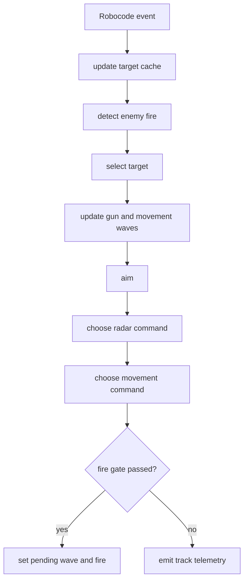
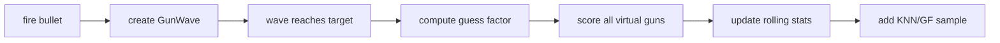

# Shared Bot Systems

This document contains behavior-level concepts used by multiple bots. Keep
bot-specific READMEs focused on what makes a bot different; put repeated
explanations here.

For implementation structures and fields, see
[Bot Core Data Structures](bot-core-data-structures.md).

## Common Control Loop

Most bots follow this pattern:



## Target Cache

Scans are stored as per-target snapshots. The important value is target age:

```text
target_age = current_turn - seen_turn
```

Bots use target age for:

- fire gating
- stale target drop
- radar reacquire
- target scoring
- telemetry interpretation

`bot_core.targeting.TargetMemory` is the shared cache wrapper for stale-target
queries, fresh-target iteration, and recent fire-threat lookup. Target selection
uses `TargetSelector` with a bot-provided scoring function so bot personality
stays local while reacquire behavior stays consistent.

## Radar

Radar helpers live in `bot_core.radar`.

Common modes:

- `lock`: target is fresh enough to track.
- `reacquire`: target exists but is stale or the radar needs overscan.
- `search`: no usable target.

The radar usually prioritizes the selected target, but can also consider a
recent fire threat. This keeps the gun/radar pair from staring at an obsolete
point forever.

## Virtual Guns

Virtual gun behavior lives in `bot_core.gun`.

Typical aim modes:

- `linear`: intercept target assuming current velocity.
- `head_on`: direct bearing.
- `displacement`: average historical displacement.
- `traditional_gf`: guess-factor profile.
- `anti_surfer`: historical escape bias.
- `dynamic_cluster`: KNN guess-factor estimate.

The selected mode is reported as `aim_mode`.

Gun selection is sticky. A different mode must have enough visits and beat the
current score by a margin before the bot switches. A first `gun.switch` event
with `previous=null` is an initial selection, not real churn.

`VirtualGunSystem` remains the compatibility facade. Internally, wave storage,
virtual-gun scoring, and aim-mode switching are isolated in `GunWaveTracker`,
`VirtualGunScorer`, and `AimModeSelector`.

## Gun Learning



Core targeting uses Robocode bullet speed, gun heat, and maximum escape angle.
The exact formulas and guess-factor details are in
[Bot Core Data Structures](bot-core-data-structures.md#guess-factor-math).

## Fire Gate

Shared fire-gate helpers live in `bot_core.energy`. The package also owns
enemy-energy drop classification, correction ledgers, enemy fire-power
prediction, and gun-heat tracking behind compatibility exports.

Bots generally fire only when:

```text
target_age <= FIRE_MEMORY_TURNS
abs(gun_bearing_error) <= alignment_limit
own_energy > critical threshold
own_energy > firepower + safety_margin
```

The telemetry field `gun_bearing` is a bearing error, not an absolute heading.
`0` means the gun is aligned with the desired aim.
`FireDecision.reason` is used as the hold reason when a bot does not fire.

## Enemy Fire Detection

Enemy fire is inferred from corrected energy drops. Accepted fire requires:

```text
0.1 <= corrected_drop <= 3.0
scan_gap <= max_scan_gap
not close-collision noise
```

Detected fire creates:

- a movement wave
- an enemy fire-power sample
- a gun-heat update
- an evasion window

Expected fire can also be generated from gun heat when the enemy is likely ready
to shoot again. The exact energy-drop correction and sample fields are described
in [Bot Core Data Structures](bot-core-data-structures.md#enemy-fire-prediction).
`EnemyFireDetector` owns the common correction, classification, gun-heat, and
fire-power sample update sequence; bots still own movement-wave creation and
evasion policy.

## Movement Learning

Shared movement learning lives in `bot_core.movement`.

Common pieces:

- movement waves from enemy fire
- guess-factor movement bins
- segmented stats buffers
- movement flattening
- go-to surfing
- bullet shadows
- minimum-risk movement

Danger is blended from profile bins and the stats-buffer ensemble, then adjusted
for unvisited bins. The exact approximation is in
[Bot Core Data Structures](bot-core-data-structures.md#movement-wave-and-profile).
Flattening compares current lateral danger against the opposite direction and
switches when the opposite side is meaningfully safer.

`MovementFlattener` remains the facade used by bots. Internally, wave storage,
profile bins, danger scoring, and go-to surfing are split into
`MovementWaveStore`, `MovementProfile`, `MovementDangerModel`, and
`SurfingPlanner`. Movement command output can be represented as
`MovementCommand` so strategy selection can be tested separately from live bot
API calls.

## Minimum Risk Movement

Minimum-risk movement is mostly used in melee. It scores candidate destinations:

```text
risk = enemy_proximity
     + close_enemy_penalty
     + focus_target_distance_penalty
     + wall_risk
     + travel_risk
     + recent_destination_penalty
     + optional fire_threat terms
```

The active destination is sticky for a short time so the bot does not jitter.

## Telemetry

Telemetry is JSONL. Common event names:

- `track`: target, radar, aim, movement, fire gate.
- `gun.switch`: selected gun mode changes or initial selection.
- `gun.wave_visit`: virtual gun scoring result.
- `enemy.fire_detected`: confirmed enemy fire.
- `enemy.gun_heat_wave`: expected enemy fire.
- `movement.profile_visit`: movement wave learning.
- `movement.flatten`: lateral direction flip.
- `movement.minimum_risk`: melee destination.
- `wall.avoid`, `separate`: sampled movement status.
- `search`, `target.reacquire`: sampled target/radar status.
- `bullet.fired`, `bullet.hit_bot`, `hit.bullet`.

Structured telemetry helpers live in `bot_core.telemetry`. `DebugLogger`
remains the sink used by bots, while domain emitters in `telemetry.fire`,
`telemetry.movement`, `telemetry.energy`, and `telemetry.targeting` keep
event-specific field construction out of bot orchestration code.
The recorder and debug log sink use bounded background writers by default so
file I/O does not block the bot loop; overflow is summarized with lifecycle
events instead of delaying movement, radar, or gun decisions.

Shared dashboard/analyzer semantics are defined in `bot_core.telemetry.schema`
and documented in [Telemetry Event Schema](telemetry-schema.md).
The JSONL envelope remains stable, and bot-specific extra fields are allowed,
but common fields should keep the same meaning across bots:

- `target`
- `distance`
- `power`
- `damage`
- `bullet_id`
- `aim_mode`
- `gun_mode`
- `movement_mode`
- `mode`
- `evasion`
- `evading`
- `wall_risk`
- `reason`

The telemetry viewer normalizes raw event fields into these dashboard concepts
before computing cards, charts, and performance summaries. The decision stream
shows compact summaries for common lifecycle and decision events; the raw JSONL
files and event API remain the source for deeper debugging. This allows
Circle/Sweep to keep their simpler track schema while Adaptive/Chase keep richer
target and movement context without breaking shared analyzers.

See [Tooling: Telemetry Viewer](tooling.md#telemetry-viewer) for launch,
reset, audit, and stop commands.
