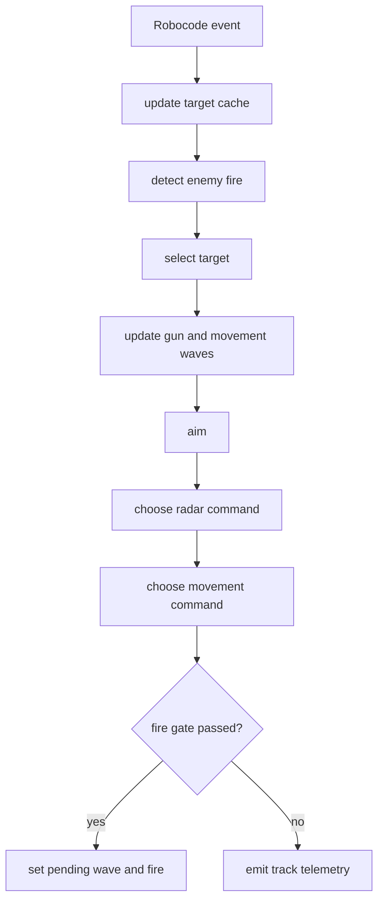
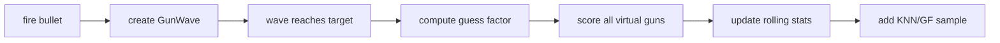

# Shared Bot Systems

This document contains behavior-level concepts used by multiple bots. Keep
bot-specific READMEs focused on what makes a bot different; put repeated
explanations here.

For implementation structures and fields, see
[Bot Core Data Structures](bot-core-data-structures.md).

## Common Control Loop

Most bots follow this pattern:



## Target Cache

Scans are stored as per-target snapshots. The important value is target age:

```text
target_age = current_turn - seen_turn
```

Bots use target age for:

- fire gating
- stale target drop
- radar reacquire
- target scoring
- telemetry interpretation

`bot_core.targeting.TargetMemory` is the shared cache wrapper for stale-target
queries, fresh-target iteration, and recent fire-threat lookup. Adaptive Prime
uses it with `TargetSelector`, which delegates scoring to bot-specific strategy
code. Chase Lock, Circle Strafer, and Sweep Pressure still keep local target
dictionaries and selection helpers, but they follow the same
`TargetSnapshot`/target-age contract.

## Radar

Radar helpers live in `bot_core.radar`.

Common modes:

- `lock`: target is fresh enough to track.
- `reacquire`: target exists but is stale or the radar needs overscan.
- `search`: no usable target.

The radar usually prioritizes the selected target, but can also consider a
recent fire threat. This keeps the gun/radar pair from staring at an obsolete
point forever.

## Virtual Guns

Virtual gun behavior lives in `bot_core.gun`.

Typical aim modes:

- [`linear`](../bots/bot_core/gun/guns/linear/README.md): intercept target
  assuming current velocity. Force-testable variants
  `linear_wall_aware` and `linear_accel_damped` use the same component package
  to compare wall-hit-aware and acceleration-damped prediction.
- [`head_on`](../bots/bot_core/gun/guns/head_on/README.md): direct bearing.
- [`displacement`](../bots/bot_core/gun/guns/displacement/README.md): average
  historical displacement.
- [`traditional_gf`](../bots/bot_core/gun/guns/traditional_gf/README.md):
  guess-factor profile.
- [`anti_surfer`](../bots/bot_core/gun/guns/anti_surfer/README.md):
  historical escape bias.
- [`dynamic_cluster`](../bots/bot_core/gun/guns/dynamic_cluster/README.md):
  KNN guess-factor estimate.

The selected mode is reported as `aim_mode`.

Gun selection is sticky. A different mode must have enough visits, clear its
mode-specific score floor, and beat the current score by a margin before the
bot switches. `GunSelectorConfig.switch_confidence_visits` and
`GunSelectorConfig.switch_confidence_penalty` can optionally reduce low-visit switch
scores before those gates are applied; they default to disabled. A first
`gun.switch` event with `previous=null` is an initial selection, not real
churn. `gun.switch_decision` records sampled candidate diagnostics so tuning
can distinguish unavailable guns from candidates blocked by visits, score
floor, margin, or a better superseding candidate.

`VirtualGunSystem` remains the stable facade. Internally, it builds an
`AimContext`, asks a `GunRegistry` of concrete gun components for available
bearings, passes those bearings to `AimModeSelector`, and publishes resolved
production-wave visits back to the components for learning. Wave storage,
virtual-gun scoring, and aim-mode switching are isolated in `GunWaveTracker`,
`VirtualGunScorer`, and `AimModeSelector`. Concrete guns live under
[`bot_core.gun.guns`](../bots/bot_core/gun/guns/README.md): stateless
`head_on`/`linear`, history-backed `displacement`, KNN-backed
`dynamic_cluster`, profile-backed `traditional_gf`, and profile-backed
`anti_surfer`. Each package README documents its behavior flow, owned state,
selector policy surface, and telemetry notes.

Traditional guess-factor aiming always keeps a global profile per target; that
global profile is the shared default. Bots that enable segmented traditional GF
can blend normalized global and exact-segment profile peaks when enough samples
exist in the current exact segment. If the exact segment is sparse, a coarse
segment can blend fixed distance, lateral speed, and wall-margin context before
falling back to the global profile. Profile interpretation defaults to the
strongest histogram bin, but bots can opt into a density-supported peak selector
for experiments that should prefer broader local mass over isolated spikes.
Track telemetry can include
`traditional_gf_*` fields showing global/segment peaks, profile weights,
selected GF, blend, and source.
`gun.traditional_gf_profile` records the same model diagnostics as a sampled
model event, which keeps scripted telemetry useful even when selector or `track`
samples are sparse.

Bots may optionally apply a source-trust penalty to `traditional_gf` selection.
This lets a bot require more evidence from low-context global profiles while
trusting exact or coarse segment profiles normally. Shared defaults leave this
disabled unless a bot config opts in. Selector thresholds and source penalties
are supplied as per-mode policy data, so the selector does not need concrete gun
classes or mode-specific threshold branches.
`tools/gun_eval_summary.py` groups Traditional GF real hit rate, model
diagnostics, and GF error by profile source so source-trust changes can be
validated before changing selector policy.

The current repo bots enable live `traditional_gf` bearings only in 1v1, where
segmented gun stats are also enabled. In melee, `traditional_gf` remains a
selectable policy mode but is reported as unavailable because the bots do not
produce that bearing.

## Gun Learning



Core targeting uses Robocode bullet speed, gun heat, and maximum escape angle.
The exact formulas and guess-factor details are in
[Bot Core Data Structures](bot-core-data-structures.md#guess-factor-math).

## Fire Gate

Shared fire-gate helpers live in `bot_core.energy`. The package also owns
enemy-energy drop classification, correction ledgers, enemy fire-power
prediction, and gun-heat tracking behind compatibility exports.

Bots generally fire only when:

```text
target_age <= FIRE_MEMORY_TURNS
abs(gun_bearing_error) <= alignment_limit
own_energy > critical threshold
own_energy > firepower + safety_margin
```

The telemetry field `gun_bearing` is a bearing error, not an absolute heading.
`0` means the gun is aligned with the desired aim.
`FireDecision.reason` is used as the hold reason when a bot does not fire.

## Enemy Fire Detection

Enemy fire is inferred from corrected energy drops. Accepted fire requires:

```text
0.1 <= corrected_drop <= 3.0
scan_gap <= max_scan_gap
not close-collision noise
```

Detected fire creates:

- a movement wave
- an enemy fire-power sample
- a gun-heat update
- an evasion window

Expected fire can also be generated from gun heat when the enemy is likely ready
to shoot again. Gun heat is not used as a hard veto against a valid energy-drop
fire in the shared detector; direct energy evidence wins over a stale heat
estimate. The exact energy-drop correction and sample fields are described in
[Bot Core Data Structures](bot-core-data-structures.md#enemy-fire-prediction).
Adaptive Prime uses `EnemyFireDetector` for the common correction,
classification, gun-heat, and fire-power sample update sequence; Circle Strafer
and Sweep Pressure use the same shared detector. Chase Lock currently keeps a
local detection method while sharing `EnergyDropConfig`, `classify_energy_drop`,
`EnemyEnergyCorrectionLedger`, and the telemetry emitters.

## Movement Learning

Shared movement learning lives in `bot_core.movement`.

Common pieces:

- movement waves from enemy fire
- guess-factor movement bins
- segmented stats buffers
- movement flattening
- go-to surfing
- bullet shadows
- minimum-risk movement

Danger is blended from profile bins and the stats-buffer ensemble, then adjusted
for unvisited bins. The exact approximation is in
[Bot Core Data Structures](bot-core-data-structures.md#movement-wave-and-profile).
Flattening compares current lateral danger against the opposite direction and
switches when the opposite side is meaningfully safer.

`MovementFlattener` remains the facade used by bots. Internally, wave storage,
profile bins, danger scoring, and go-to surfing are split into
`MovementWaveStore`, `MovementProfile`, `MovementDangerModel`, and
`SurfingPlanner`. Movement command output can be represented as
`MovementCommand` so strategy selection can be tested separately from live bot
API calls. Go-to surfing uses a Tank Royale order movement predictor, and
bullet shadows use the real bullet state from `BulletFiredEvent` instead of the
bot position at callback time. Wall-limited escape-angle calculations use the
same predictor with the target's current direction and speed, so movement-wave
normalization sees the same acceleration, turn-rate, and wall-stop constraints
as surfing simulations.

## Minimum Risk Movement

Minimum-risk movement is mostly used in melee. It scores candidate destinations:

```text
risk = enemy_proximity
     + close_enemy_penalty
     + focus_target_distance_penalty
     + wall_risk
     + travel_risk
     + recent_destination_penalty
     + optional fire_threat terms
```

The active destination is sticky for a short time so the bot does not jitter.

## Telemetry

Telemetry is JSONL. Common event names:

- `track`: target, radar, aim, movement, fire gate.
- `gun.switch`: selected gun mode changes or initial selection.
- `gun.switch_decision`: sampled selector diagnostics for available and
  unavailable candidate guns.
- `gun.traditional_gf_profile`: sampled traditional-GF model source, global
  and segment peaks, profile weights, blend, and selected GF.
- `gun.wave_visit`: virtual gun scoring result, including optional
  traditional-GF aim/error/source diagnostics.
- `gun.eval_wave_visit`: optional neutral gun-evaluation result. These visits
  are separate from production switcher stats.
- `gun.fire_drift`: planned production wave compared with the actual
  `BulletFiredEvent` bullet state.
- `enemy.fire_detected`: confirmed enemy fire, including optional inferred fire
  turn and source-position diagnostics.
- `enemy.gun_heat_wave`: expected enemy fire.
- `movement.profile_visit`: movement wave learning.
- `movement.flatten`: lateral direction flip.
- `movement.minimum_risk`: melee destination.
- `wall.avoid`, `separate`: sampled movement status.
- `search`, `scan.reacquired`, `target.drop_lost`, `target.stale`: sampled
  target/radar status.
- `bullet.fired`, `bullet.hit_bot`, `hit.bullet`.

Structured telemetry helpers live in `bot_core.telemetry`. `DebugLogger`
remains the sink used by bots, while domain emitters in `telemetry.fire`,
`telemetry.movement`, `telemetry.energy`, and `telemetry.targeting` keep
event-specific field construction out of bot orchestration code.
The recorder and debug log sink use bounded background writers by default so
file I/O does not block the bot loop; overflow is summarized with lifecycle
events instead of delaying movement, radar, or gun decisions.

Shared dashboard/analyzer semantics are defined in `bot_core.telemetry.schema`
and documented in [Telemetry Event Schema](telemetry-schema.md).
The JSONL envelope remains stable, and bot-specific extra fields are allowed,
but common fields should keep the same meaning across bots:

- `target`
- `distance`
- `power`
- `damage`
- `bullet_id`
- `aim_mode`
- `gun_mode`
- `movement_mode`
- `mode`
- `evasion`
- `evading`
- `wall_risk`
- `reason`

The telemetry viewer normalizes raw event fields into these dashboard concepts
before computing cards, charts, and performance summaries. The decision stream
shows compact summaries for common lifecycle and decision events; the raw JSONL
files and event API remain the source for deeper debugging. This allows
Circle/Sweep to keep their simpler track schema while Adaptive/Chase keep richer
target and movement context without breaking shared analyzers.

See [Tooling: Telemetry Viewer](tooling.md#telemetry-viewer) for launch,
reset, audit, and stop commands.
