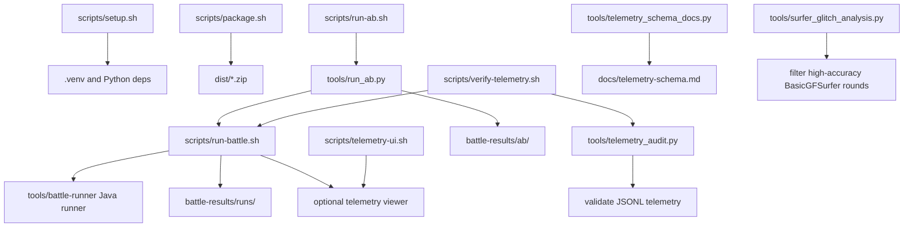

# Tooling

This document describes the local tools around the bots: setup, packaging,
battle running, telemetry, A/B testing, and diagnostics.

## Tool Map



## Environment

Local machine settings live in `.env`, copied from `.env.example`.

Important variables:

- `PYTHON_BIN`: Python used by `scripts/setup.sh` to create `.venv`.
- `ROBOCODE_PYTHON_BIN`: Python used by bot launchers and telemetry tooling
  when you do not want the repo `.venv`.
- `ROBOCODE_LEGACY_BOTS_ROOT`: directory containing converted legacy bots.
  Leave empty to use the repo-local ignored `legacy-bots/` directory.
- `ROBOCODE_TELEMETRY_DIR`: default GUI telemetry JSONL directory.
- `ROBOCODE_TELEMETRY_HOST` / `ROBOCODE_TELEMETRY_PORT`: telemetry viewer bind
  address.
- `ROBOCODE_TELEMETRY_QUEUE_SIZE`: bounded async telemetry queue size, default
  `16384`.
- `ROBOCODE_TELEMETRY_SYNC=1`: force legacy synchronous telemetry writes for
  debugging recorder behavior.
- `ROBOCODE_DEBUG_QUEUE_SIZE`: bounded async debug-log queue size, default
  `8192`.
- `ROBOCODE_DEBUG_SYNC=1`: force legacy synchronous debug-log writes.

The `.env` file is intentionally ignored by git.

## Setup

```sh
scripts/setup.sh
```

Creates `.venv` if needed and installs `requirements.txt`.

Use this before local development or CLI battles unless you have configured
`ROBOCODE_PYTHON_BIN` to point to another suitable Python.

## Packaging

```sh
scripts/package.sh
```

Discovers every bot directory under `bots/` that has a bot manifest and writes:

```text
dist/adaptive-prime.zip
dist/chase-lock.zip
dist/circle-strafer.zip
dist/sweep-pressure.zip
```

Each archive contains:

- one bot directory
- shared `bot_core`

The package script excludes `.DS_Store`, `__pycache__`, and `*.pyc`.

Use packaged zips when adding bots to the Robocode Tank Royale GUI.

## Battle Runner

Main wrapper:

```sh
scripts/run-battle.sh [options] [bot-dir...]
```

If no bots are passed, it discovers all local bot directories. Helper
directories like `bots/bot_core` are ignored.

Common examples:

```sh
scripts/run-battle.sh
scripts/run-battle.sh bots/adaptive-prime bots/chase-lock
scripts/run-battle.sh --rounds 30 bots/adaptive-prime bots/chase-lock
scripts/run-battle.sh --run-dir battle-results/runs/manual-1 bots/adaptive-prime bots/chase-lock
```

Common options:

| Option | Purpose |
| --- | --- |
| `--rounds N` | Number of battle rounds. |
| `--run-dir DIR` | Output directory for this run. |
| `--results FILE` | Override results JSON path. |
| `--runner-log FILE` | Override structured runner log path. |
| `--process-log FILE` | Override raw process log path. |
| `--debug` | Enable bot text decision logs. |
| `--debug-log-dir DIR` | Override debug log directory. |
| `--telemetry` | Enable telemetry JSONL without starting a viewer. |
| `--telemetry-dir DIR` | Override telemetry JSONL directory. |
| `--telemetry-viewer` | Start telemetry viewer daemon for this run. |
| `--telemetry-open` | Start telemetry viewer daemon and open it in browser. |
| `--record` | Write `.battle.gz` recording files. |
| `--intent-diagnostics` | Capture bot intent diagnostics. |
| `--tick-sample N` | Sample runner ticks every N turns. |
| `--legacy NAME|all` | Add configured legacy bot(s). |
| `--legacy-root DIR` | Override legacy bot root. |
| `--list-legacy` | Print known legacy bots. |

### Output Layout

Default run directory:

```text
battle-results/runs/<timestamp>/
```

Files:

- `results.json`: structured final battle scores.
- `runner.log`: wrapper/runner lifecycle and sampled ticks.
- `process.log`: raw Robocode runner, server, and booter output.
- `debug/`: bot text logs when `--debug` is enabled.
- `telemetry/`: JSONL telemetry files when telemetry is enabled.
- `recordings/`: `.battle.gz` files when `--record` is enabled.
- `intents.jsonl`: intent diagnostics when enabled.

### Java Battle Runner

The shell wrapper delegates to:

```text
tools/battle-runner/src/main/java/dev/local/robocodebot/RunBattle.java
```

That runner:

- chooses `1v1` game type for two bots and melee for more bots
- starts the Tank Royale battle
- writes `results.json`
- writes runner lifecycle logs
- can capture recordings and intent diagnostics

## Debug Logs

Enable text logs:

```sh
scripts/run-battle.sh --debug bots/adaptive-prime bots/chase-lock
```

Use debug logs when you want grep-friendly event lines for:

- target selection
- radar mode
- aim mode
- movement mode
- fire decisions
- hit events

Telemetry is richer, but debug logs are simpler for quick terminal inspection.

## Telemetry Viewer

Telemetry consists of JSONL event files plus a browser viewer.

CLI battle telemetry:

```sh
scripts/run-battle.sh --telemetry bots/adaptive-prime bots/chase-lock
scripts/run-battle.sh --telemetry --telemetry-viewer bots/adaptive-prime bots/chase-lock
scripts/run-battle.sh --telemetry --telemetry-open bots/adaptive-prime bots/chase-lock
scripts/run-battle.sh --telemetry --rounds 3 bots/adaptive-prime bots/chase-lock bots/circle-strafer bots/sweep-pressure
```

`--telemetry` writes JSONL only. Add `--telemetry-viewer` to start the browser
viewer daemon, or `--telemetry-open` to start and open it.

Telemetry and debug logs are buffered through bounded background writers by
default. When a queue fills, events or log lines are dropped instead of blocking
the bot loop; telemetry records a `telemetry.dropped` lifecycle event and debug
logs record `debug.dropped` on close. Use `ROBOCODE_TELEMETRY_SYNC=1` or
`ROBOCODE_DEBUG_SYNC=1` only when debugging the recorder/logging path itself.

GUI telemetry:

```sh
scripts/telemetry-ui.sh start
scripts/telemetry-ui.sh disable
```

`start` enables GUI telemetry and runs the viewer in the foreground. GUI-launched
bots can autostart a viewer while `.telemetry-enabled` exists.

### Telemetry UI Commands

```sh
scripts/telemetry-ui.sh start [--dir DIR] [--host HOST] [--port PORT] [--no-open]
scripts/telemetry-ui.sh list
scripts/telemetry-ui.sh stop --dir battle-results/runs/<run>/telemetry
scripts/telemetry-ui.sh stop-all
scripts/telemetry-ui.sh enable
scripts/telemetry-ui.sh disable
scripts/telemetry-ui.sh status
```

Command behavior:

- `start`: enable GUI telemetry and run viewer in foreground.
- `enable`: enable GUI telemetry without starting viewer.
- `disable`: disable GUI telemetry.
- `list`: show discovered viewers, process state, health, URL, and directory.
- `stop`: stop viewer for selected telemetry directory.
- `stop-all`: stop all discovered viewers.
- `status`: show GUI telemetry switch, whether GUI writes are allowed or
  suppressed, and known viewers.

Important distinction:

```text
stop-all stops viewer processes.
disable prevents GUI-launched bots from starting a new viewer later.
```

Scripted no-telemetry battles temporarily suppress GUI-launched bot telemetry so
benchmark runs are not polluted by live logging. If a previous run left a stale
suppression marker, `scripts/telemetry-ui.sh status` reports it and
`scripts/telemetry-ui.sh enable` or `start` clears it when no scripted battle is
active.

### Telemetry Viewer Server

Server implementation:

```text
tools/telemetry_viewer/server.py
```

Useful direct options:

```sh
.venv/bin/python tools/telemetry_viewer/server.py \
  --dir battle-results/telemetry/live \
  --host 127.0.0.1 \
  --port 8765 \
  --fallback-port \
  --open
```

Server API:

- `GET /api/health`: status, telemetry directory, files.
- `GET /api/events?limit=N&cursor=C&generation=G`: incremental event stream.
- `POST /api/reset`: truncate JSONL files and clear server cache.
- `GET /api/shutdown`: stop the viewer server.

Reset truncates JSONL files; it does not delete them.
The viewer also starts a new in-memory generation when it sees a new bot
session after an existing battle, so GUI restarts or changed bot sets do not
keep stale bots in the dashboard even when old JSONL files remain in the live
telemetry directory.

## Telemetry Audit

```sh
tools/telemetry_audit.py battle-results/runs/<run>/telemetry \
  --require-bot adaptive-prime \
  --require-bot chase-lock
```

The audit validates:

- telemetry files are readable JSONL
- required bots emitted events
- required event fields exist according to `bot_core.telemetry.schema`
- bullet hits can be attributed to fired gun modes
- enemy fire events have expected evasion labels

Use it after changing telemetry fields, dashboard aggregation, or bot event
logging.

For gun-mode analysis, summarize fired bullets, real-fire wave scores, and
neutral eval-wave scores:

```sh
tools/gun_eval_summary.py battle-results/runs/<run>/telemetry --bot adaptive-prime
tools/gun_eval_summary.py battle-results/runs/<run>/telemetry --bot adaptive-prime --post-switch-shots 6
```

`gun.wave_visit` reflects production virtual-gun switching evidence from real
shots. `gun.eval_wave_visit` reflects optional neutral evaluation waves and
must be interpreted separately from production learning. When eval influence is
enabled, `gun.switch_decision` can also show selector-only `eval_score_bonus`,
`eval_visits`, and `effective_visits`. `gun.switch_decision` explains sampled
selector choices, including candidates blocked by visits, score floor, margin,
or a better superseding candidate.

The summary also reports a `calibration` table by target id and gun mode. It
compares adjusted score, raw score, confidence penalty, visits at switch time,
the next N real shots, production wave average, eval-wave average, and
score-vs-hit gaps. Use this to identify modes that look strong virtually but
underperform with real bullets before changing live switch policy.

For BasicGFSurfer-style legacy validation, use 20+ round telemetry runs so KNN
memory can warm up, then filter likely stuck-surfer rounds where Adaptive hit
accuracy is abnormally high:

```sh
tools/surfer_glitch_analysis.py battle-results/legacy-filter/<experiment>
tools/surfer_glitch_analysis.py battle-results/legacy-filter/<experiment> \
  --threshold 0.30 \
  --json-output battle-results/legacy-filter/<experiment>/filtered-summary.json
```

The tool reads cumulative `runner.log` round results and adaptive-prime
telemetry. It reports raw totals, filtered totals, per-counted-round averages,
and `pairedFiltered` metrics after excluding rounds where Adaptive accuracy is
greater than the threshold. `pairedFiltered` keeps only round numbers that are
valid on both baseline and candidate, reports excluded and unpaired rounds
separately, and prints round-by-round score/first-place/accuracy deltas. Use
`pairedFiltered` and per-round deltas when judging BasicGFSurfer gun
experiments; summed filtered deltas can be misleading when baseline and
candidate exclude different numbers of rounds. Raw improvements can be
dominated by rounds where the legacy surfer was stuck or glitchy.
Incomplete inputs and runs shorter than 20 scored rounds are reported as
warnings and make the CLI exit nonzero unless `--allow-missing-data` is passed.
For dynamic-cluster runs, the summary also reports kept/excluded diagnostic
averages such as selected-vs-actual guess-factor error, ambiguity rate, aim
confidence, peak score ratio, and effective bandwidth.

The browser viewer keeps raw JSONL fields available through the event API and
source files. Its decision stream uses readable event summaries, while cards,
charts, and performance summaries use normalized dashboard semantics derived
from the raw event. This keeps the unified viewer consistent when bots emit
different extra fields around the same concept.

For an end-to-end telemetry health check across all local bots, run:

```sh
scripts/verify-telemetry.sh --rounds 3
```

The script runs a telemetry battle with an explicit viewer daemon, audits the
JSONL files, and checks the viewer health endpoint.

The equivalent manual commands are:

```sh
scripts/run-battle.sh --telemetry --telemetry-viewer --rounds 3 bots/adaptive-prime bots/chase-lock bots/circle-strafer bots/sweep-pressure
tools/telemetry_audit.py battle-results/runs/<run>/telemetry \
  --require-bot adaptive-prime \
  --require-bot chase-lock \
  --require-bot circle-strafer \
  --require-bot sweep-pressure
```

The event contract is generated from code in
[Telemetry Event Schema](telemetry-schema.md). Regenerate it after changing
`bot_core.telemetry.schema`:

```sh
tools/telemetry_schema_docs.py --output docs/telemetry-schema.md
```

## A/B Testing

Main wrapper:

```sh
scripts/run-ab.sh --name EXPERIMENT --preset adaptive-1v1-core
```

Implementation:

```text
tools/run_ab.py
```

The A/B runner executes the same preset against two repos/worktrees:

- `baseline`
- `candidate`

By default both point at the current repo, which is useful for smoke tests but
not a true before/after comparison.

### Presets

| Preset | Target | Matchups |
| --- | --- | --- |
| `adaptive-1v1-core` | Adaptive Prime | vs Chase, Circle, Sweep |
| `chase-1v1-core` | Chase Lock | vs Adaptive, Circle, Sweep |
| `circle-1v1-core` | Circle Strafer | vs Adaptive, Chase, Sweep |
| `sweep-1v1-core` | Sweep Pressure | vs Adaptive, Chase, Circle |
| `adaptive-melee-core` | Adaptive Prime | four local bots |
| `adaptive-1v1-boss` | Adaptive Prime | DrussGT, Saguaro, BasicGFSurfer, Diamond |
| `adaptive-1v1-basic-gf-surfer` | Adaptive Prime | BasicGFSurfer only |

Default preset settings are 24 rounds and 3 repeats unless overridden.

Round-count guidance:

- `1-8` rounds are smoke checks only. Use them for crashes, packaging,
  telemetry shape, and obvious switch-churn regressions.
- `12-16` rounds with `2` repeats is a useful exploratory A/B tier while
  searching for candidate thresholds.
- `24` rounds with `3` repeats is the promotion gate before treating a tuning
  change as broadly enabled.
- `50-100+` rounds on key matchups is an optional expensive confirmation tier
  for high-risk or near-merge changes; get user confirmation before spending
  that time.
- Boss-bot checks should be repeated; a single short run against
  `basic-gf-surfer`, `diamond`, or another legacy bot is not representative.

Examples:

```sh
scripts/run-ab.sh \
  --name adaptive-gun-change \
  --preset adaptive-1v1-core \
  --baseline <baseline-worktree> \
  --candidate <candidate-worktree>

scripts/run-ab.sh --name smoke --preset adaptive-1v1-core --rounds 1 --repeats 1
```

Options:

| Option | Purpose |
| --- | --- |
| `--name NAME` | Required experiment name. |
| `--preset PRESET` | Benchmark preset. |
| `--baseline PATH` | Baseline repo/worktree. |
| `--candidate PATH` | Candidate repo/worktree. |
| `--baseline-env KEY=VALUE` | Env override for baseline runs; repeatable. |
| `--candidate-env KEY=VALUE` | Env override for candidate runs; repeatable. |
| `--rounds N` | Override preset rounds. |
| `--repeats N` | Override preset repeat count. |
| `--run-dir DIR` | Override output directory. |
| `--target-bot NAME` | Override target bot name for result extraction. |
| `--telemetry` | Enable telemetry JSONL for each battle run. |
| `--verbose` | Stream battle output to terminal as well as logs. |

### A/B Output

Default output:

```text
battle-results/ab/<timestamp>-<name>/
```

Files:

- `manifest.json`: command, preset, side repo states, matchups.
- `summary.json`: structured aggregate result.
- `summary.md`: human-readable result table.
- `baseline/<matchup>/run-*/`: run-battle outputs.
- `candidate/<matchup>/run-*/`: run-battle outputs.

Decision labels:

- `win`: candidate improved without meaningful first-place regression.
- `regression`: candidate lost enough score or first places.
- `mixed`: results moved in conflicting directions.

Telemetry is off by default during A/B runs. The runner warns if telemetry
viewers are discovered afterward, because live telemetry can add noise and make
benchmark results less comparable. Use `--telemetry` for diagnostics or
BasicGFSurfer validation that needs per-round hit-rate filtering:

```sh
scripts/run-ab.sh \
  --name basic-gf-surfer-gun-check \
  --preset adaptive-1v1-basic-gf-surfer \
  --rounds 24 \
  --repeats 3 \
  --telemetry \
  --candidate-env ROBOCODE_ADAPTIVE_DYNAMIC_BANDWIDTH_MIN=0.08 \
  --candidate-env ROBOCODE_ADAPTIVE_DYNAMIC_BANDWIDTH_MAX=0.22 \
  --baseline <baseline-worktree> \
  --candidate <candidate-worktree>

tools/surfer_glitch_analysis.py battle-results/ab/<experiment>
```

Dynamic-cluster tuning env vars are shared by policy shape but per bot in name:
`ROBOCODE_ADAPTIVE_DYNAMIC_*`, `ROBOCODE_CHASE_DYNAMIC_*`,
`ROBOCODE_CIRCLE_DYNAMIC_*`, and `ROBOCODE_SWEEP_DYNAMIC_*`.

## Battle Series

```sh
scripts/run-battle-series.sh --runs 5 --rounds 24 bots/adaptive-prime bots/chase-lock
```

Runs the battle runner repeatedly and summarizes score metrics across runs. Use
this for quick variance checks when a full baseline/candidate A/B setup is not
needed.

## Legacy Bots

Configured legacy bots can be added to CLI battles:

```sh
scripts/run-battle.sh --list-legacy
scripts/run-battle.sh --rounds 10 bots/adaptive-prime --legacy drussgt
scripts/run-battle.sh --rounds 10 bots/adaptive-prime --legacy saguaro
scripts/run-battle.sh --rounds 10 bots/adaptive-prime --legacy basic-gf-surfer
scripts/run-battle.sh --rounds 10 bots/adaptive-prime --legacy diamond
scripts/run-battle.sh bots/adaptive-prime legacy:wiki.BasicGFSurfer_1.02
scripts/run-battle.sh --legacy all
```

Legacy bots are resolved from `ROBOCODE_LEGACY_BOTS_ROOT`, or from the
repo-local ignored `legacy-bots/` directory when the variable is empty. For
headless CLI battles, the runner creates a small shim so converted legacy bots
can run in the headless process environment.

## Recommended Workflows

### Quick Bot Smoke

```sh
scripts/run-battle.sh --rounds 1 bots/adaptive-prime bots/chase-lock
```

### Debug A Behavior

```sh
scripts/run-battle.sh --rounds 3 --debug --telemetry --telemetry-viewer bots/adaptive-prime bots/chase-lock
tools/telemetry_audit.py battle-results/runs/<run>/telemetry --require-bot adaptive-prime --require-bot chase-lock
```

### Validate A Change

```sh
scripts/run-ab.sh --name candidate-check --preset adaptive-1v1-core --baseline <baseline-worktree> --candidate <candidate-worktree>
```

### Clean Up Viewers

```sh
scripts/telemetry-ui.sh stop-all
scripts/telemetry-ui.sh disable
scripts/telemetry-ui.sh status
```
