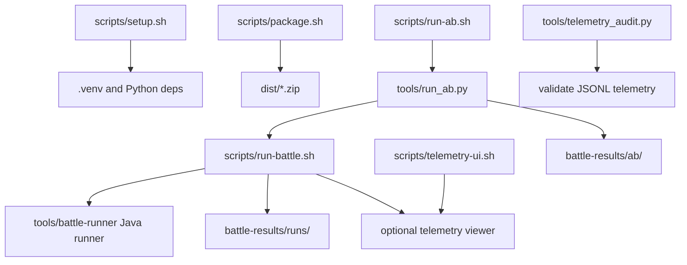

# Tooling

This document describes the local tools around the bots: setup, packaging,
battle running, telemetry, A/B testing, and diagnostics.

## Tool Map



## Environment

Local machine settings live in `.env`, copied from `.env.example`.

Important variables:

- `PYTHON_BIN`: Python used by `scripts/setup.sh` to create `.venv`.
- `ROBOCODE_PYTHON_BIN`: Python used by bot launchers and telemetry tooling
  when you do not want the repo `.venv`.
- `ROBOCODE_LEGACY_BOTS_ROOT`: directory containing converted legacy bots.
  Leave empty to use the repo-local ignored `legacy-bots/` directory.
- `ROBOCODE_TELEMETRY_DIR`: default GUI telemetry JSONL directory.
- `ROBOCODE_TELEMETRY_HOST` / `ROBOCODE_TELEMETRY_PORT`: telemetry viewer bind
  address.

The `.env` file is intentionally ignored by git.

## Setup

```sh
scripts/setup.sh
```

Creates `.venv` if needed and installs `requirements.txt`.

Use this before local development or CLI battles unless you have configured
`ROBOCODE_PYTHON_BIN` to point to another suitable Python.

## Packaging

```sh
scripts/package.sh
```

Discovers every bot directory under `bots/` that has a bot manifest and writes:

```text
dist/adaptive-prime.zip
dist/chase-lock.zip
dist/circle-strafer.zip
dist/sweep-pressure.zip
```

Each archive contains:

- one bot directory
- shared `bot_core`

The package script excludes `.DS_Store`, `__pycache__`, and `*.pyc`.

Use packaged zips when adding bots to the Robocode Tank Royale GUI.

## Battle Runner

Main wrapper:

```sh
scripts/run-battle.sh [options] [bot-dir...]
```

If no bots are passed, it discovers all local bot directories. Helper
directories like `bots/bot_core` are ignored.

Common examples:

```sh
scripts/run-battle.sh
scripts/run-battle.sh bots/adaptive-prime bots/chase-lock
scripts/run-battle.sh --rounds 30 bots/adaptive-prime bots/chase-lock
scripts/run-battle.sh --run-dir battle-results/runs/manual-1 bots/adaptive-prime bots/chase-lock
```

Common options:

| Option | Purpose |
| --- | --- |
| `--rounds N` | Number of battle rounds. |
| `--run-dir DIR` | Output directory for this run. |
| `--results FILE` | Override results JSON path. |
| `--runner-log FILE` | Override structured runner log path. |
| `--process-log FILE` | Override raw process log path. |
| `--debug` | Enable bot text decision logs. |
| `--debug-log-dir DIR` | Override debug log directory. |
| `--telemetry` | Enable telemetry JSONL and start viewer daemon. |
| `--telemetry-dir DIR` | Override telemetry JSONL directory. |
| `--telemetry-open` | Open telemetry viewer in browser. |
| `--record` | Write `.battle.gz` recording files. |
| `--intent-diagnostics` | Capture bot intent diagnostics. |
| `--tick-sample N` | Sample runner ticks every N turns. |
| `--legacy NAME|all` | Add configured legacy bot(s). |
| `--legacy-root DIR` | Override legacy bot root. |
| `--list-legacy` | Print known legacy bots. |

### Output Layout

Default run directory:

```text
battle-results/runs/<timestamp>/
```

Files:

- `results.json`: structured final battle scores.
- `runner.log`: wrapper/runner lifecycle and sampled ticks.
- `process.log`: raw Robocode runner, server, and booter output.
- `debug/`: bot text logs when `--debug` is enabled.
- `telemetry/`: JSONL telemetry files when telemetry is enabled.
- `recordings/`: `.battle.gz` files when `--record` is enabled.
- `intents.jsonl`: intent diagnostics when enabled.

### Java Battle Runner

The shell wrapper delegates to:

```text
tools/battle-runner/src/main/java/dev/local/robocodebot/RunBattle.java
```

That runner:

- chooses `1v1` game type for two bots and melee for more bots
- starts the Tank Royale battle
- writes `results.json`
- writes runner lifecycle logs
- can capture recordings and intent diagnostics

The macOS `sysctl failed` cleanup warning can appear after battles. It is a
Robocode booter process-tree cleanup issue; if results are written and bots
stop, it is usually not a battle failure.

## Debug Logs

Enable text logs:

```sh
scripts/run-battle.sh --debug bots/adaptive-prime bots/chase-lock
```

Use debug logs when you want grep-friendly event lines for:

- target selection
- radar mode
- aim mode
- movement mode
- fire decisions
- hit events

Telemetry is richer, but debug logs are simpler for quick terminal inspection.

## Telemetry Viewer

Telemetry consists of JSONL event files plus a browser viewer.

CLI battle telemetry:

```sh
scripts/run-battle.sh --telemetry bots/adaptive-prime bots/chase-lock
scripts/run-battle.sh --telemetry --telemetry-open bots/adaptive-prime bots/chase-lock
```

GUI telemetry:

```sh
scripts/telemetry-ui.sh start
scripts/telemetry-ui.sh disable
```

`start` enables GUI telemetry and runs the viewer in the foreground. GUI-launched
bots can autostart a viewer while `.telemetry-enabled` exists.

### Telemetry UI Commands

```sh
scripts/telemetry-ui.sh start [--dir DIR] [--host HOST] [--port PORT] [--no-open]
scripts/telemetry-ui.sh list
scripts/telemetry-ui.sh stop --dir battle-results/runs/<run>/telemetry
scripts/telemetry-ui.sh stop-all
scripts/telemetry-ui.sh enable
scripts/telemetry-ui.sh disable
scripts/telemetry-ui.sh status
```

Command behavior:

- `start`: enable GUI telemetry and run viewer in foreground.
- `enable`: enable GUI telemetry without starting viewer.
- `disable`: disable GUI telemetry.
- `list`: show discovered viewers, process state, health, URL, and directory.
- `stop`: stop viewer for selected telemetry directory.
- `stop-all`: stop all discovered viewers.
- `status`: show GUI telemetry switch and known viewers.

Important distinction:

```text
stop-all stops viewer processes.
disable prevents GUI-launched bots from starting a new viewer later.
```

### Telemetry Viewer Server

Server implementation:

```text
tools/telemetry_viewer/server.py
```

Useful direct options:

```sh
.venv/bin/python tools/telemetry_viewer/server.py \
  --dir battle-results/telemetry/live \
  --host 127.0.0.1 \
  --port 8765 \
  --fallback-port \
  --open
```

Server API:

- `GET /api/health`: status, telemetry directory, files.
- `GET /api/events?limit=N&cursor=C`: incremental event stream.
- `POST /api/reset`: truncate JSONL files and clear server cache.
- `GET /api/shutdown`: stop the viewer server.

Reset truncates JSONL files; it does not delete them.

## Telemetry Audit

```sh
tools/telemetry_audit.py battle-results/runs/<run>/telemetry \
  --require-bot adaptive-prime \
  --require-bot chase-lock
```

The audit validates:

- telemetry files are readable JSONL
- required bots emitted events
- required event fields exist
- bullet hits can be attributed to fired gun modes
- enemy fire events have expected evasion labels

Use it after changing telemetry fields, dashboard aggregation, or bot event
logging.

## A/B Testing

Main wrapper:

```sh
scripts/run-ab.sh --name EXPERIMENT --preset adaptive-1v1-core
```

Implementation:

```text
tools/run_ab.py
```

The A/B runner executes the same preset against two repos/worktrees:

- `baseline`
- `candidate`

By default both point at the current repo, which is useful for smoke tests but
not a true before/after comparison.

### Presets

| Preset | Target | Matchups |
| --- | --- | --- |
| `adaptive-1v1-core` | Adaptive Prime | vs Chase, Circle, Sweep |
| `chase-1v1-core` | Chase Lock | vs Adaptive, Circle, Sweep |
| `circle-1v1-core` | Circle Strafer | vs Adaptive, Chase, Sweep |
| `sweep-1v1-core` | Sweep Pressure | vs Adaptive, Chase, Circle |
| `adaptive-melee-core` | Adaptive Prime | four local bots |
| `adaptive-1v1-boss` | Adaptive Prime | configured legacy boss |

Default preset settings are 24 rounds and 3 repeats unless overridden.

Examples:

```sh
scripts/run-ab.sh \
  --name adaptive-gun-change \
  --preset adaptive-1v1-core \
  --baseline <baseline-worktree> \
  --candidate <candidate-worktree>

scripts/run-ab.sh --name smoke --preset adaptive-1v1-core --rounds 1 --repeats 1
```

Options:

| Option | Purpose |
| --- | --- |
| `--name NAME` | Required experiment name. |
| `--preset PRESET` | Benchmark preset. |
| `--baseline PATH` | Baseline repo/worktree. |
| `--candidate PATH` | Candidate repo/worktree. |
| `--rounds N` | Override preset rounds. |
| `--repeats N` | Override preset repeat count. |
| `--run-dir DIR` | Override output directory. |
| `--target-bot NAME` | Override target bot name for result extraction. |
| `--verbose` | Stream battle output to terminal as well as logs. |

### A/B Output

Default output:

```text
battle-results/ab/<timestamp>-<name>/
```

Files:

- `manifest.json`: command, preset, side repo states, matchups.
- `summary.json`: structured aggregate result.
- `summary.md`: human-readable result table.
- `baseline/<matchup>/run-*/`: run-battle outputs.
- `candidate/<matchup>/run-*/`: run-battle outputs.

Decision labels:

- `win`: candidate improved without meaningful first-place regression.
- `regression`: candidate lost enough score or first places.
- `mixed`: results moved in conflicting directions.

Telemetry is intentionally off during A/B runs. The runner warns if telemetry
viewers are discovered afterward, because live telemetry can add noise and make
benchmark results less comparable.

## Battle Series

```sh
scripts/run-battle-series.sh --runs 5 --rounds 24 bots/adaptive-prime bots/chase-lock
```

Runs the battle runner repeatedly and summarizes score metrics across runs. Use
this for quick variance checks when a full baseline/candidate A/B setup is not
needed.

## Legacy Bots

Configured legacy bots can be added to CLI battles:

```sh
scripts/run-battle.sh --list-legacy
scripts/run-battle.sh --rounds 10 bots/adaptive-prime --legacy basic-gf-surfer
scripts/run-battle.sh bots/adaptive-prime legacy:wiki.BasicGFSurfer_1.02
scripts/run-battle.sh --legacy all
```

Legacy bots are resolved from `ROBOCODE_LEGACY_BOTS_ROOT`, or from the
repo-local ignored `legacy-bots/` directory when the variable is empty. For
headless CLI battles, the runner creates a small shim so converted legacy bots
can run in the headless process environment.

## Recommended Workflows

### Quick Bot Smoke

```sh
scripts/run-battle.sh --rounds 1 bots/adaptive-prime bots/chase-lock
```

### Debug A Behavior

```sh
scripts/run-battle.sh --rounds 3 --debug --telemetry --telemetry-open bots/adaptive-prime bots/chase-lock
tools/telemetry_audit.py battle-results/runs/<run>/telemetry --require-bot adaptive-prime --require-bot chase-lock
```

### Validate A Change

```sh
scripts/run-ab.sh --name candidate-check --preset adaptive-1v1-core --baseline <baseline-worktree> --candidate <candidate-worktree>
```

### Clean Up Viewers

```sh
scripts/telemetry-ui.sh stop-all
scripts/telemetry-ui.sh disable
scripts/telemetry-ui.sh status
```
